# Source-verified execution và data-flow guide

Tài liệu này trả lời hai câu hỏi xuyên suốt:

1. **Code đang chạy từ đâu đến đâu?**
2. **Data đang đi từ đâu đến đâu?**

Mọi mô tả bên dưới được dựng lại từ source code hiện tại. Các file trong `results/`,
`.artifacts/` và `data/generated/` chỉ được dùng như ví dụ để trace; chúng có thể cũ hơn source hoặc
thuộc một lần chạy chưa hoàn tất.

**Phạm vi kiểm chứng:** đọc source và một số artifact đang có ngày 16/09/2026, trên worktree có
HEAD `e1e724e0b15962614fbf5bd580d3dfd65c79d686` và thay đổi chưa commit. Không chạy lại generator,
Docker, benchmark, report hoặc presentation. “Code sẽ gọi” và “lần chạy đã thành công” là hai
khẳng định khác nhau; tài liệu này xác minh khẳng định thứ nhất bằng source.

**Cách sử dụng:** đọc mục 1–4 để có bản đồ; theo Step 0–12 ở mục 5 với M02 làm ví dụ;
làm checklist mục 9; dùng bài trace cụ thể ở mục 12 để tự kiểm tra. Các đường dẫn trong bảng và
code block đều tương đối từ repository nên có thể mở trên mọi checkout của project.

## 1. Kết luận kiến trúc trước khi đọc chi tiết

Flow giả định ban đầu cần sửa ở năm điểm:

1. **Không có một entry point duy nhất.** `Makefile` là operational API cấp cao; data generation,
   research benchmark, report, presentation và release là các chương trình/target riêng.
2. **`make benchmark` không sinh dữ liệu.** Nó yêu cầu dataset và `manifest.json` đã tồn tại.
   `make research-data` là prerequisite vận hành riêng. Chỉ `benchmark-one` khai báo dependency
   `research-data` trong Makefile.
3. **Benchmark không đọc source Parquet trực tiếp.** Một Spark application riêng import Parquet
   vào Iceberg và chốt snapshot IDs; mỗi benchmark application sau đó đọc đúng snapshot Iceberg.
4. **Report và presentation không được gọi từ `run_research_suite.py`.** `make report` là bước
   riêng. `build_presentation.mjs` đọc report artifacts và dựng PPTX trong Codex presentation
   runtime; Makefile chỉ finalise/verify một PPTX đã tồn tại.
5. **Core benchmark E-commerce hiện đọc Bronze, không đọc Silver/Gold.** Các bảng Silver/Gold
   được build và audit, nhưng sáu workload M02/M04/M05/M08/M10/B01 đều bind bảng nguồn Bronze.
   B01 tự join và aggregate lại orders/customers/order_items, không SELECT từ gold.daily_revenue.

Vì vậy, project không phải một pipeline duy nhất mà là bốn flow nối với nhau bằng immutable
artifacts:

```mermaid
flowchart LR
    subgraph A[Data preparation - chạy riêng]
        A1[E-commerce profile] --> A2[Deterministic row iterators]
        A2 --> A3[PyArrow Parquet]
        T1[Locked DBGEN source] --> T2[TPC-H .tbl]
        T2 --> T3[PyArrow Parquet]
        A3 --> A4[Dataset manifest + validation]
        T3 --> A4
    end

    subgraph B[Research benchmark]
        B1[Experiment YAML + workload YAML + SQL] --> B2[Attestation + experiment manifest]
        A4 --> B2
        B2 --> B3[Compose services + capacity/calibration gates]
        B3 --> B4[Parquet to Iceberg build]
        B4 --> B5[Pinned Iceberg snapshots]
        B4 --> B10[Silver / Gold E-commerce: được tạo và audit]
        B5 --> B11[Core bindings: Bronze E-commerce hoặc namespace tpch]
        B11 --> B6[Fresh Spark baseline apps]
        B11 --> B7[Fresh Spark plus Comet apps]
        B6 --> B8[App result + event log + resource samples]
        B7 --> B8
        B8 --> B9[Immutable raw records]
    end

    subgraph C[Analysis - chạy riêng]
        B9 --> C1[Summary + statistics]
        C1 --> C2[Plan/resource/research findings]
        C2 --> C3[JSON + CSV + SVG + Markdown report]
        C3 --> C4[Publishability decision]
    end

    subgraph D[Delivery - chạy riêng]
        C3 -. JSON artifacts, builder chạy riêng .-> D1[Native PowerPoint charts/tables]
        C4 --> D1
        D1 --> D2[PPTX finalization manifest]
        D2 --> D3[Evidence bundle]
    end
```



## 2. Phân biệt các lớp thường bị trộn lẫn

| Thành phần | Vai trò thật | Nằm ở đâu |
|---|---|---|
| Source Parquet | Dataset đầu vào bất biến, do PyArrow ghi, không phải Iceberg table | `data/generated/<dataset-id>/<table>/part-*.parquet` |
| Spark | Compute engine, tạo application, đọc Parquet khi import và đọc Iceberg snapshot khi benchmark | `pipeline/medallion/build.py`, `pipeline/benchmark/run_query.py` |
| Iceberg | Table format: schema, snapshot, metadata, manifest list và data-file references | Catalog `lakehouse`, warehouse `s3://lakehouse/warehouse` |
| Iceberg REST catalog | API catalog cho Spark; backend catalog dùng SQLite trong named volume | service `iceberg-rest`, volume `iceberg-catalog` |
| MinIO | S3-compatible object storage giữ Iceberg warehouse objects | service `minio`, volume `minio-data` |
| Workload manifest | YAML contract do project viết: query ID, bindings, parameters, expected schema, correctness | `workloads/manifests/**/*.yaml` |
| Iceberg manifest | Metadata file do Iceberg tự tạo, liệt kê data/delete files của một snapshot | dưới warehouse ở MinIO; `manifest_list` URI được audit ghi lại |
| Experiment manifest | Kế hoạch campaign bất biến: resolved config, schedule và input hashes | `.artifacts/campaigns/<experiment>/experiment-manifest.json` |
| Raw record | Một terminal record đã hợp nhất app result, event metrics, cgroup metrics và provenance | `results/raw/<experiment>/<engine>/<run-id>.json` |

`workload manifest` và `Iceberg manifest` chỉ trùng từ “manifest”; chúng không cùng format, không
cùng lifecycle và không gọi lẫn nhau.

## 3. Repository survey và mức độ quan trọng

### LEVEL 1 — Phải hiểu kỹ

| File/folder | Trách nhiệm |
|---|---|
| `Makefile` | Public operational graph; cho biết target nào thật sự gọi target nào. |
| `pyproject.toml` | Khai báo CLI `lakehouse-bench = benchmark.cli:main`. |
| `scripts/run_research_suite.py` | Orchestrate 10 core campaigns, dataset attestation, plan và image identity xuyên suite. |
| `scripts/run_research_campaign.py` | Runtime adapter: Compose, capacity/calibration, Iceberg build, retries, Spark submit, verification. |
| `benchmark/runner/config.py` | Parse/validate config, đối chiếu executable Spark profiles, build immutable experiment manifest. |
| `benchmark/runner/campaign.py` | Materialize run plan, gates, resume, retry và hard timeout. |
| `pipeline/medallion/build.py` | Spark đọc source Parquet, tạo Iceberg Bronze/Silver/Gold hoặc TPC-H tables, audit snapshots. |
| `pipeline/benchmark/run_query.py` | Một fresh Spark application: snapshot binding, warm-up, measured `collect()`, plan/result/resource artifacts. |
| `benchmark/runner/record.py` | Hợp nhất application result, Spark event-log metrics và worker cgroup metrics thành raw result. |
| `data/generator/{profiles,prf,rows,generate,validation}.py` | E-commerce profile, deterministic fields, quan hệ bảng, Parquet generation và semantic validation. |
| `benchmark/configs/*.yaml` | Experiment identity, run count, timeout, data path, common Spark conf và engine matrix. |
| `workloads/manifests/**/*.yaml` + `workloads/**/*.sql` | Query contract và SQL thực thi. |
| `infrastructure/spark/profiles/*.properties` | Common Spark envelope và các config duy nhất bật Comet. |
| `benchmark/runner/{summary,statistics}.py` | Mean/median/IQR/p95, paired speedup, resource savings và bootstrap CI. |
| `analysis/scripts/build_report.py` | Raw records thành summaries, charts, tables, Markdown và publishability artifacts. |

### LEVEL 2 — Hiểu trách nhiệm chính, đọc sâu khi trace đến boundary đó

| File/folder | Trách nhiệm |
|---|---|
| `benchmark/cli.py` | `validate`, `plan`, `analyze-plan`, `summarize`; bridge từ CLI vào runner modules. |
| `benchmark/runner/dataset_attestation.py` | Full semantic validation receipt hoặc exact ancestor rebind. |
| `benchmark/runner/{schedule,sql,canonical,runtime,evidence,capacity}.py` | Schedule AB/BA, typed SQL rendering, hashes, runtime lock, provenance và capacity policy. |
| `benchmark/parsers/{eventlog,plan}.py` | Spark event attribution và native/fallback plan classification. |
| `benchmark/collectors/resources.py` | Driver/worker resource sampling và aggregation. |
| `analysis/{plan_insights,resource_profiles,research_findings,report_charts}.py` | Các derived analysis chuyên biệt và SVG rendering. |
| `analysis/report_publishability.py` | Reconstruct độc lập xem evidence có đủ để công bố hay không. |
| `docker-compose.yml` | Service graph, ports, volumes, resource limits, REST catalog và MinIO. |
| `runtime-versions.lock`, `uv.lock` | Exact runtime/dependency identity. |
| `scripts/ensure_research_data.py`, `scripts/ensure_tpch_data.py` | Primary data generation gates và validation. |
| `data/tpch/` | Locked DBGEN acquisition, `.tbl` conversion, schemas, PK/FK/date validation. |
| `deliverables/presentation/build_presentation.mjs` | Builder nội dung PPTX; cần đọc khi tới chặng presentation, không được `make report` gọi. |

### LEVEL 3 — Chỉ cần biết tồn tại trước, đọc khi cần kiểm chứng

- `benchmark/schemas/*.json`: contract cho từng artifact; đọc cạnh một instance thật.
- `tests/`: executable specification cho happy path và fail-closed behavior.
- `pipeline/smoke/` và `scripts/run_native_smoke.sh`: vertical slice nhỏ, không phải research result.
- `infrastructure/docker/`: exact image/classpath construction.
- `docs/adr/`, `docs/project_specification.md`, `docs/implementation-status.md`: scope và quyết định.
- `scripts/finalize_presentation.py`, demo/video và evidence-bundle code: delivery integrity.
- `.github/workflows/{ci,native-smoke}.yml`: CI gọi lint/test/plan/Compose validation; workflow
  native riêng chạy smoke. Không phải research suite tự động tạo report/slide.

### LEVEL 4 — Có thể bỏ qua lúc đầu

- `.pytest_cache/`, `.mypy_cache/`, `.ruff_cache/`, `__pycache__/`, `.venv/`.
- Generated Parquet bytes, toàn bộ Spark event-log lines và mọi raw record cùng lúc.
- Golden plans ngoài workload đang trace.
- Archive/rollback scripts cho evidence cũ.
- Demo video capture/finalization internals.
- Diagnostic deliverables cũ trong `deliverables/`.

Generated artifacts không phải “rác”; chúng là bằng chứng để trace một run. Nhưng không nên đọc
tuần tự như source code.

`README.md` và specification có mô tả định hướng rộng hơn implementation: chưa tìm thấy nhánh
ingest PostgreSQL trong `data/`, `pipeline/`, `scripts/`, `benchmark/`, `infrastructure/` đã khảo sát;
`analysis/` hiện chứa Python modules, không có notebook thực thi report. `analysis/plots/` và
`results/normalized/` có placeholder; report builder thực tế ghi SVG/CSV vào `results/reports/`.

## 4. Entry points thực sự

| Ý định | Entry point | Ghi chú |
|---|---|---|
| Public orchestration | `Makefile` | `benchmark`, `report`, `release`, `run-all` là các flow khác nhau. |
| CLI validate/plan/summarize | `lakehouse-bench` → `benchmark.cli:main` | Khai báo trong `pyproject.toml`. |
| E-commerce generator CLI | `python -m data.generator` → `data.generator.__main__:main` | Có subcommand `generate` và `validate`. |
| Primary E-commerce data | `scripts/ensure_research_data.py:main` | Enforce clean worktree, exact Python, free disk. |
| Primary TPC-H-derived data | `scripts/ensure_tpch_data.py:main` | Locked DBGEN → `.tbl` → Parquet. |
| Research suite | `scripts/run_research_suite.py:main` | Default 10 configs; từ chối chạy native trực tiếp trên Windows. |
| One campaign | `scripts/run_research_campaign.py:main` | Được suite gọi bằng subprocess. |
| One Spark query app | `pipeline/benchmark/run_query.py:main` | Được Docker executor gọi bằng `spark-submit`. |
| Medallion/Iceberg build | `pipeline/medallion/build.py:main` | Spark application riêng, nằm ngoài query measurement. |
| Report | `analysis.scripts.build_report:main` | `make report` gọi với `--require-publishable`. |
| Presentation build | `deliverables/presentation/build_presentation.mjs` | Codex presentation runtime; không được Makefile gọi. |
| Presentation evidence | `scripts/finalize_presentation.py:main` | Validate deck/report inventory, tạo sidecar manifest. |
| Release bundle | `scripts/build_evidence_bundle.py:main` | Đóng gói evidence đã finalise. |

## 5. Trace chi tiết từ entry point đến output

### Step 0 — Chọn operational flow

```text
Step: 0 — Chọn flow cần chạy
File: Makefile
Function/Class: target research-data, benchmark, report, release, run-all
Called by: người dùng/CI gọi make
Calls: ensure_* scripts, run_research_suite.py, build_report, finalizers, evidence bundle
Input: target + biến PROFILE/BENCHMARK_CONFIG/PRESENTATION/...
Output: subprocesses và artifacts tương ứng với target
Data đi đâu tiếp: chỉ đi sang target dependency được khai báo; không có pipeline ngầm
```

Với `make` chạy tuần tự thông thường, `make benchmark` thực tế là
`setup → lint → test → compose-config → run_research_suite.py`. Đây là các prerequisites cùng cấp
trong Makefile, không phải chuỗi dependency đảm bảo thứ tự khi dùng `make -j`.
Nó không gọi `research-data`, `report` hoặc presentation builder.

### Step 1 — Chuẩn bị dataset E-commerce hoặc TPC-H-derived

```text
Step: 1A — E-commerce primary dataset
File: scripts/ensure_research_data.py
Function/Class: main() → ensure_research_data()
Called by: make research-data-ecommerce hoặc chạy trực tiếp
Calls: load_profile(), generate_dataset(), validate_dataset()
Input: data/generator/configs/small.yaml, runtime-versions.lock, Git state, free disk
Output: data/generated/ecommerce-small-uniform-seed-20260827-v3/** + manifest.json
Data đi đâu tiếp: dataset attestation và pipeline/medallion/build.py
```

```text
Step: 1B — TPC-H-derived primary dataset
File: scripts/ensure_tpch_data.py; data/tpch/source.py; data/tpch/dataset.py
Function/Class: ensure_tpch_data() → materialize_dbgen_tables() → build_dataset_from_tbl()
Called by: make research-data-tpch hoặc chạy trực tiếp
Calls: load_source_lock(), locked DBGEN build/generate, validate_tpch_dataset()
Input: runtime source lock, clean Git, exact Python, DBGEN source, 20 GiB free-disk gate
Output: data/generated/tpch-derived-sf1-v1/** + manifest.json
Data đi đâu tiếp: dataset attestation và TPC-H branch của medallion build
```

### Step 2 — Sinh E-commerce rows và ghi Parquet

```text
Step: 2 — Deterministic E-commerce generation
File: data/generator/generate.py; rows.py; prf.py; schemas.py; manifest.py
Function/Class: generate_dataset() → _write_table() → iter_table_rows() → *_row()
Called by: ensure_research_data() hoặc data.generator.__main__:main()
Calls: field_digest()/integer_inclusive()/timestamp_inclusive(), PyArrow Table, ParquetWriter
Input: immutable GeneratorProfile
Output: iterator dict rows → PyArrow batches → Snappy Parquet parts + manifest.json
Data đi đâu tiếp: validate_dataset(); sau đó Spark import đọc chính các file manifest khai báo
```

Generator không trả về Spark DataFrame. `GenerationResult` chỉ chứa paths và manifest mapping; dữ
liệu lớn được stream thành Python dict rows, chuyển từng batch sang `pyarrow.Table`, rồi ghi
Parquet.

### Step 3 — Validate dataset, tạo attestation và experiment manifest

```text
Step: 3 — Suite preparation/control plan
File: scripts/run_research_suite.py; benchmark/cli.py; benchmark/runner/config.py;
      benchmark/runner/dataset_attestation.py
Function/Class: prepare_suite() → _ensure_dataset_attestation() → command_plan()
                → load_experiment() → build_experiment_manifest()
Called by: run_research_suite.py:main() hoặc make research-plan
Calls: validate/rebind/create attestation, workload validation, SQL rendering, schedule builder,
       SHA-256 hashing, immutable JSON writer
Input: experiment YAML, workload YAML, SQL, dataset manifest, runtime lock, Spark profiles, Git
Output: dataset attestation + .artifacts/campaigns/<id>/experiment-manifest.json
Data đi đâu tiếp: run_suite() gọi run_research_campaign.py cho từng experiment
```

Experiment manifest chứa resolved config, paired schedule và hashes của config, SQL, workload
manifest, dataset manifest, runtime/dependency locks và Spark profiles.

### Step 4 — Khởi động runtime và admission gates

```text
Step: 4 — One campaign admission
File: scripts/run_research_campaign.py; docker-compose.yml
Function/Class: main() → _compose_up() → _capacity_gate() → _collector_calibration()
Called by: run_research_suite.py:run_suite() qua subprocess
Calls: Docker Compose, image/storage/cpu probes, capacity policy, resource collector calibration
Input: experiment manifest/config, dataset manifest, exact Docker image expectation, host state
Output: capacity-gate attempt, calibration artifact, shared-runtime identity
Data đi đâu tiếp: _prepare_medallion()
```

Services thực tế là MinIO, MinIO init, Iceberg REST, Spark master và Spark worker. `spark-client`
được tạo theo từng tool/query invocation; không phải service chạy thường trực.

### Step 5 — Spark đọc Parquet và tạo Iceberg snapshots

```text
Step: 5 — Parquet to Iceberg
File: scripts/run_research_campaign.py; pipeline/medallion/build.py
Function/Class: _prepare_medallion() → spark-submit → build.main()
Called by: campaign main(), trước mọi correctness/plan/measurement run
Calls: SparkSession.builder.getOrCreate(), spark.read.schema(...).parquet(), spark.sql(DDL/INSERT/CTAS),
       _quality_audit(), _latest_snapshot()
Input: dataset manifest + declared Parquet files + attestation + common Spark properties
Output: Iceberg tables in MinIO/catalog + medallion.json audit with row counts and snapshot IDs
Data đi đâu tiếp: DockerCampaignExecutor pins snapshot IDs for every query relation
```

E-commerce branch:

- Bronze: `customers`, `products`, `orders`, `order_items`, `events`.
- Silver: `sales_enriched`, `events`.
- Gold: `daily_revenue`, `customer_ltv`, `product_ranking`, `category_growth`.
- `bronze.orders` và `silver.sales_enriched` dùng `months(order_time)`;
  `bronze.events` và `silver.events` dùng `months(event_time)`. Các table còn lại trong build này
  không khai báo partition transform.

TPC-H branch import tám bảng trực tiếp vào namespace `lakehouse.tpch`; nó không tạo Bronze/Silver/
Gold.

`medallion.json` trong research flow hiện nằm dưới
`.artifacts/research-shared/<commit>/<image-sha>/<storage-identity>/datasets/<dataset-manifest-sha>/<attestation-sha>/`.
`_prepare_medallion()` tái dùng audit hợp lệ khi identity khớp; do đó không phải mỗi campaign đều
ghi lại toàn bộ Iceberg tables. DataFrame không đi qua subprocess: chương trình tiếp theo nhận
đường dẫn JSON audit rồi đọc lại Iceberg.

### Step 6 — Materialize campaign runs

```text
Step: 6 — Logical run plan
File: benchmark/runner/campaign.py; benchmark/runner/schedule.py
Function/Class: plan_campaign(); CampaignRun
Called by: CampaignRunner.run()
Calls: expand manifest schedule thành immutable run identities
Input: experiment-manifest.json
Output: 4 gate runs + 2 × measurement_runs measurement runs
Data đi đâu tiếp: CampaignRunner.run() duyệt correctness → plan_capture → measurement
```

Với core config có `measurement_runs: 10`, một experiment có 24 run slots:

- baseline + Comet correctness;
- baseline + Comet plan capture;
- 10 paired measurements, mỗi pair có cả hai engine theo deterministic AB/BA order.

### Step 7 — Launch một fresh Spark application

```text
Step: 7 — Execute one run
File: scripts/run_research_campaign.py; pipeline/benchmark/run_query.py
Function/Class: DockerCampaignExecutor.__call__() → _spark_submit_command() → run_query.main()
Called by: CampaignRunner.run()
Calls: new attempt dir, worker sampler, run_subprocess(), SparkSession, workload load/render,
       _load_snapshot(), _run_warmups(), _execute_collect(), analyze_plan()
Input: CampaignRun, experiment config, workload manifest, SQL, medallion snapshot audit,
       engine-specific SparkConf
Output: application-result.json, initial-plan.txt, final-plan.txt,
        driver-resource-samples.json, Spark event log, worker-resource-samples.json, stdout/stderr
Data đi đâu tiếp: event-log parser và raw-record builder
```

Đường chạy bên trong `run_query.main()`:

```text
load_experiment()
  → load workload manifest
  → render_sql()
  → SparkSession.builder.getOrCreate()
  → fingerprint(runtime/classpath)
  → read each pinned Iceberg snapshot
  → validate required column types/nullability
  → createOrReplaceTempView(view_name)
  → warm-up collect() × warmup_runs
  → spark.catalog.clearCache()
  → arm resource samplers
  → setJobGroup(run_id)
  → measured spark.sql(...).collect()
  → schema/result hashes + final-plan analysis
  → application-result.json
```

### Step 8 — Parse metrics và publish raw result

```text
Step: 8 — Evidence merge và publication
File: scripts/run_research_campaign.py; benchmark/parsers/eventlog.py;
      benchmark/runner/record.py; benchmark/collectors/resources.py
Function/Class: DockerCampaignExecutor.__call__() → parse_event_log() → build_raw_record()
                → select_measured_execution(); sau đó CampaignRunner.run() → write_json()
Called by: CampaignRunner.run() gọi executor; executor trả về record mapping
Calls: SQL/job/stage/task attribution, execution-family aggregation, cgroup summary merge,
       raw-result JSON Schema validation
Input: application-result.json + Spark event log + worker samples + RawRecordContext/provenance
Output: results/raw/<experiment>/<engine>/<run-id>.json
Data đi đâu tiếp: CampaignRunner correctness/plan gates, campaign verification và report builder
```

Success records được publish vào `results/raw`. Trong retry mode, `failed` và `timeout` được giữ ở
`.artifacts/campaigns/<id>/failed-attempts` và retry tối đa ba attempts. `invalid_result` và
`invalid_environment` không retry và hard-stop.

### Step 9 — Campaign verification và suite continuation

```text
Step: 9 — Close one campaign
File: scripts/run_research_campaign.py; scripts/run_research_suite.py
Function/Class: _write_campaign_verification(); _campaign_image(); _completed_campaign_image()
Called by: campaign main() sau CampaignRunner.run(); suite sau subprocess completion
Calls: raw/control tree hashing, completion counters, exact image/provenance checks
Input: all planned raw records + attempts + capacity/calibration + medallion + attestation
Output: campaign-verification attempt artifact
Data đi đâu tiếp: suite dùng cùng admitted image cho campaign kế tiếp; report dùng verification
```

### Step 10 — Tính statistics và derived analysis

```text
Step: 10 — Raw results to summaries
File: benchmark/runner/summary.py; benchmark/runner/statistics.py;
      analysis/{plan_insights,resource_profiles,research_findings}.py
Function/Class: summarize_records() → describe()/pair_speedups_by_id()/
                paired_bootstrap_median_speedup(); build_*()
Called by: analysis.scripts.build_report:build_report()
Calls: per-engine descriptive stats, per-pair ratios/savings, plan/resource analyses
Input: schema-valid measurement raw records
Output: per-experiment summary mappings + plan/resource/research findings
Data đi đâu tiếp: JSON/CSV/SVG/Markdown renderers
```

### Step 11 — Tạo report, chart và table

```text
Step: 11 — Report build
File: analysis/scripts/build_report.py; analysis/report_charts.py;
      analysis/report_publishability.py
Function/Class: build_report() → assess_report_publishability() → summarize_records()
                → build_plan_insights()/build_resource_profiles()/build_research_findings()
                → chart functions → _report_markdown() → _report_contract()
Called by: make report hoặc python -m analysis.scripts.build_report
Calls: raw schema validation, independent evidence reconstruction, SVG/CSV/JSON/Markdown writers
Input: results/raw/** + .artifacts/campaigns/** + repository/config state
Output: results/reports/*.summary.json, *.svg, *.csv, analysis JSON,
        technical-report.md, report-contract.json, report-publishability.json,
        report-artifact-inventory.json
Data đi đâu tiếp: presentation builder, video/demo finalizers và evidence bundle
```

### Step 12 — Tạo và finalise presentation

```text
Step: 12 — Report to PowerPoint
File: deliverables/presentation/build_presentation.mjs; scripts/finalize_presentation.py
Function/Class: top-level builder → Presentation.create()/slide.charts.add()/exportPptx();
                finalize_presentation()
Called by: builder được invoke trong Codex presentation runtime; finalizer bởi make presentation-finalize
Calls: read report JSONs, create editable native charts/tables, package/layout validation,
       report-inventory rebinding
Input: report-contract.json, report-publishability.json, suite-summary.json,
       research-findings.json, plan-insights.json, experiment summaries, Q01 resource profile
Output: deliverables/presentation/*.pptx + *.manifest.json
Data đi đâu tiếp: scripts/build_evidence_bundle.py và release ZIP
```

Presentation không nhúng lại các SVG report làm nguồn chính. Builder đọc machine-readable JSON và
tạo native editable PowerPoint charts/tables. Speaker notes trỏ ngược về report artifacts.

Có hai hàm gần tên nhưng khác vai trò: JS helper `finalizePresentation()` được builder import từ
runtime ngoài repo để kiểm tra/layout và xuất deck; Python `finalize_presentation()` trong repo
được gọi riêng để kiểm tra evidence và ghi sidecar. Không có lời gọi trực tiếp từ JS builder sang
Python finalizer của repository.

## 6. Deep dive theo câu hỏi trọng tâm

### 6.1 Data generation: ID, seed, timestamp và quan hệ

Nguồn semantic chính là `data/generator/rows.py`.

| Table | ID/PK | Quan hệ được tạo |
|---|---|---|
| `customers` | `customer_id = 1..N` | độc lập; region/segment/signup được derive theo field |
| `products` | `product_id = 1..N` | độc lập; category/base price/created time được derive theo field |
| `orders` | `order_id = 1..N` | `customer_id` luôn nằm trong range customers; `order_time >= signup_time + 3 phút` |
| `order_items` | `(order_id, line_number)` | exact requested total được phân bổ qua orders; `product_id` luôn tồn tại; price dựa trên product base price |
| `events` | `event_id = 1..N` | mỗi order được cấp nhóm bốn event view → cart → checkout → purchase, cùng session/customer; chỉ hai bước đầu có product_id, chỉ purchase có order_id; phần còn lại là browse độc lập/có thể anonymous |

Pseudo-randomness không dùng process-global RNG. `field_digest()` tính:

```text
SHA256(generator_version | seed | table | primary_key | field)
```

Do đó đổi batch size, file split hoặc generation order không làm đổi một field. IDs là range tuần
tự; values/timestamps là hash-derived. Timestamp luôn timezone-aware UTC trong profile, sau đó được
Spark đọc với session timezone UTC.

Với `small.yaml`: seed `20260827`, khoảng thời gian từ `2025-01-01T00:00:00Z` đến
`2025-12-31T23:59:59Z`; 100.000 customers, 10.000 products, 1.000.000 orders, 4.000.000 items,
5.000.000 events. `line_count_for_order()` chia tổng items theo thương/dư: profile này có đúng
4 items/order. `order_item_row()` lấy giá product bằng hàm deterministic, không lookup Spark.
`customer_row()` giới hạn signup tới dataset_end − 5 phút; order_time nằm giữa signup + 3 phút
và dataset_end. Bốn event phiên order lần lượt ở order_time − 3, −2, −1 và 0 phút. Purchase event
được tạo cho mọi order, kể cả order có status khác COMPLETED; không suy diễn đây là dữ liệu thực.

Quan hệ cần tự vẽ: `customers 1 → N orders 1 → N order_items N → 1 products`;
`events.customer_id/product_id/order_id` có thể null theo quy tắc trên. ID chính là số tuần tự
hoặc khóa ghép; tên/session token/timestamp được derive bằng hash, không lấy đồng hồ hiện tại.

Nhánh TPC-H dùng DBGEN riêng: `materialize_dbgen_tables()` build source khóa trong runtime lock,
chạy DBGEN SF1, rồi `build_dataset_from_tbl()` copy tám `.tbl` vào `raw/`, parse kiểu bằng
`parse_tbl_row()`, chuẩn hóa qua `iter_normalized_tbl_rows()`, ghi Parquet bằng `_convert_table()`.
Directory mặc định là `data/generated/tpch-derived-sf1-v1`, nhưng `dataset_id` bên trong manifest
là `tpch-derived-sf1-<12 ký tự source commit>-v1`; không được dùng hai chuỗi này thay nhau.

Output lifecycle:

```text
GeneratorProfile
→ Iterator[dict]
→ pending list tối đa 16,384 rows
→ pyarrow.Table.from_pylist(schema=explicit)
→ ParquetWriter Snappy
→ TableAudit + PK-range Merkle + min/max/null counts
→ manifest.json
→ atomic rename temp directory thành immutable dataset directory
```

### 6.2 Parquet và Spark

- Parquet được ghi bởi `data/generator/generate.py:_write_table()` hoặc
  `data/tpch/dataset.py:build_dataset_from_tbl()`.
- Source files nằm dưới `data/generated/<dataset-id>/<table>/part-*.parquet` và được mount read-only
  vào Spark containers.
- Spark lần đầu tham gia research data path ở `pipeline/medallion/build.py:main()`.
- `SparkSession` được tạo bằng `SparkSession.builder.appName(...).getOrCreate()` trong medallion
  build và lại được tạo fresh trong mỗi `run_query.py` application.
- Source Parquet được đọc tại:
  `spark.read.schema(explicit_schema).parquet(*manifest_declared_paths)`.
- Benchmark query không nhận DataFrame từ generator. Nó load Iceberg snapshot thành DataFrame,
  validate binding, rồi đăng ký temp view mà SQL manifest đã đặt tên.

### 6.3 Iceberg, catalog, warehouse, metadata, snapshot và partition

Spark properties xác định:

```text
catalog name: lakehouse
catalog implementation: org.apache.iceberg.spark.SparkCatalog
catalog type: REST
REST URI: http://iceberg-rest:8181
warehouse: s3://lakehouse/warehouse
FileIO: org.apache.iceberg.aws.s3.S3FileIO
S3 endpoint: http://minio:9000
```

REST service dùng JDBC catalog với SQLite trong `iceberg-catalog` volume; actual Iceberg metadata
và data files nằm trong MinIO `minio-data` volume. `_latest_snapshot()` query metadata table
`<table>.snapshots` và ghi `snapshot_id` cùng `manifest_list` vào `medallion.json`.

Benchmark gọi:

```python
spark.read.format("iceberg").option("versionAsOf", snapshot_id).load(table)
```

nên baseline và Comet bị khóa vào cùng logical version ngay cả khi catalog có snapshot mới hơn.

### 6.4 Workload resolution

Ba lớp input khác nhau:

1. Experiment YAML chọn query/dataset/runtime, cung cấp parameter values và measurement protocol.
2. Workload YAML định nghĩa reusable contract: logical relations, required columns, parameter
   types, expected result schema/hash và ordering rule.
3. SQL file chỉ chứa template query.

`benchmark.cli:_validate_inputs()` kiểm tra ba lớp thống nhất. `render_sql()` reject thiếu/thừa hoặc
sai kiểu parameter. `run_query.main()` resolve mỗi logical binding thành pinned Iceberg table,
tạo temp view theo `relation_bindings` rồi chạy rendered SQL.

| Query đã triển khai | Logical tables trong manifest | Quan hệ vật lý sau binding |
|---|---|---|
| M02 filter; M05 low-cardinality aggregation | orders | lakehouse.bronze.orders |
| M04 join | order_items, products | lakehouse.bronze.order_items/products |
| M08 window; M10 shuffle aggregation | events | lakehouse.bronze.events |
| B01 daily regional revenue | orders, customers, order_items | ba bảng lakehouse.bronze tương ứng |
| Q01 pricing summary; Q06 revenue change | lineitem | lakehouse.tpch.lineitem |
| Q03 shipping priority | customer, orders, lineitem | ba bảng lakehouse.tpch tương ứng |
| Q12 shipping modes/priority | orders, lineitem | hai bảng lakehouse.tpch tương ứng |

Đọc `workloads/manifests/` cạnh SQL cùng ID. `workload.data_path` trong experiment là descriptor;
research app lấy table/view thực sự từ `relation_bindings` và `_table_identifier()`, không gọi
`spark.read.parquet(config['workload']['data_path'])`. Core có 10 query trên, không phải toàn bộ
M01–M10, B01–B10 hay 22 truy vấn TPC-H trong định hướng ban đầu.

### 6.5 Benchmark, baseline và Comet

Common config được đọc từ
`infrastructure/spark/profiles/benchmark-laptop-common.properties`. Baseline engine có
`spark_conf: {}`. Comet engine thêm config qua từng `--conf` trong `_spark_submit_command()`:

- `spark.plugins=org.apache.spark.CometPlugin`;
- Comet shuffle manager;
- `spark.comet.enabled`, `spark.comet.exec.enabled`, native load required, native shuffle;
- Iceberg native scan, strict floating point, memory pool và explain/fallback settings.

Không có nhánh SQL riêng cho Comet; cùng config, SQL, snapshot và resource envelope được dùng.

Comet không được bật/tắt giữa hai query trong cùng SparkSession. Mỗi run tạo process/app mới:
baseline không nạp plugin và không nhận các delta Comet; Comet nhận các `--conf` từ YAML matrix.
`validate_runtime_profile()` bắt matrix khớp chính xác file Comet properties. JAR có sẵn trong
image không đồng nghĩa plugin đang hoạt động; `fingerprint()` và plan gate kiểm tra runtime/plan.

| Cơ chế | Source of truth |
|---|---|
| Warm-up | `experiment.warmup_runs`; chỉ measurement runs nhận giá trị này; core = 2 |
| Repeated runs | `measurement_runs`; core = 10 pair × 2 engines |
| Order | deterministic paired randomized AB/BA schedule |
| Cache | mỗi run là fresh app; warm-up chạy `collect()`, sau đó `spark.catalog.clearCache()`; label `warm-storage-cache` không có nghĩa Spark DataFrame cache được giữ |
| Timeout | `experiment.timeout_seconds`; core = 1800s; `run_subprocess()` terminate/kill process group |
| Retry | `MAX_RUN_ATTEMPTS = 3`; chỉ `failed`/`timeout`; failed attempts giữ bất biến |
| Correctness gate | schema hash + row count + canonical result hash + same snapshots |
| Plan gate | complete plan; baseline có 0 Comet native operator; Comet có ít nhất 1 |

Ranh giới đo chính xác trong `_execute_collect()`:

```text
setJobGroup(run_id)
start = perf_counter_ns()
  frame = spark.sql(rendered_sql)
  initial_plan = frame._jdf.queryExecution().sparkPlan().toString()
  rows = frame.collect()
query_wall_time_ms = (perf_counter_ns() - start) / 1_000_000
final_plan = frame._jdf.queryExecution().executedPlan().toString()
```

Vì vậy latency bao gồm tạo query/initial-plan capture và collect về Python, không chỉ executor
execution time. Spark startup, binding snapshot, warm-up, tính correctness hash và ghi JSON nằm
ngoài timer. Hard timeout 1800 giây áp cho subprocess Spark submission, bao gồm startup/warm-up,
không chỉ vùng timer này. `clearCache()` không xóa OS page cache hoặc cache của MinIO; không có
bước drop toàn bộ storage cache trong query runner.

### 6.6 Metrics và results

| Metric/evidence | Nguồn | Function tạo/chuyển đổi |
|---|---|---|
| `query_wall_time_ms` | Python monotonic wall clock quanh `spark.sql(...).collect()` | `_execute_collect()` |
| `sql_execution_time_ms` | Spark SQL start/end events của execution family gắn `jobGroupId=run_id` | `parse_event_log()` → `select_measured_execution()` |
| CPU core-seconds | Spark TaskEnd `executorCpuTime` tổng hợp, ns → s | `eventlog.py` → `build_raw_record()` |
| JVM GC | Spark TaskEnd `jvmGCTime` | như trên |
| Shuffle read/write, disk spill | Spark TaskEnd metrics | như trên, bytes → decimal MB |
| Peak memory/CPU percent | worker cgroup sampler | `resources.py` + `_resource_summary()` |
| Driver samples | in-process sampler trong Spark client container | `run_query.py` artifact; không thay worker metric |
| Native coverage | count-based parse của final physical plan | `analyze_plan()` |
| Fallback reasons/transitions | final plan text | `analyze_plan()` |
| Correctness | schema JSON hash, row count, canonical collected-row hash | `run_query.py` + `benchmark/runner/sql.py` |

`spark.comet.metrics.enabled=false` trong executable Comet profile. Vì vậy project hiện không thu
một stream “Comet runtime metrics” riêng; native coverage là tỷ lệ operator dựa trên final physical
plan, không phải phần trăm CPU time hoặc wall time chạy native.

Công thức native coverage là `native / (native + fallback)` sau khi chọn AQE final section;
wrappers và transitions được xử lý riêng, node không biết làm analysis thành `partial`, baseline
có coverage `null`. Parser event log tính cả các TaskEnd attempts thất bại được quy thuộc hợp lệ;
SQL family không phải toàn bộ Spark application hay toàn bộ warm-up jobs.

Lưu ý khi đọc memory: `aggregate_samples()` lấy max của sampled `memory.current` và reported
`memory.peak`. Worker container được tái dùng, không thấy bước reset `memory.peak` theo từng query;
vì vậy không được mặc định field peak là bộ nhớ tăng thêm chỉ do query hiện tại. CPU core-seconds
trong raw record đến từ Spark TaskEnd, còn cgroup sampler cũng có CPU counter riêng. Hai nguồn
khác phạm vi, không được thay thế lẫn nhau.

Raw result nằm ở `results/raw`. Supporting plans/logs/samples nằm ở `.artifacts/campaigns/...` và
được raw record tham chiếu bằng relative paths.

Statistics:

- `describe()` tính `n`, median, mean, sample stddev, q1, q3, IQR, min, max.
- p95 chỉ có khi `n >= 20`; mỗi engine core hiện có 10 measurement observations nên per-engine p95
  là `null` theo policy, không phải lỗi.
- paired speedup cho mỗi pair là `Spark latency / Comet latency`.
- `summarize_records()` tính ratio of medians riêng, không đánh đồng nó với median paired speedup.
- Bootstrap median paired speedup dùng 10,000 resamples, deterministic seed `20260824`, percentile
  CI 95%.
- `percentile()` nội suy linear R7. Suite speedup trong `build_report()` là geometric mean của
  median paired speedup từng query; không gộp tất cả latency rồi chia.

### 6.7 Report và presentation

`build_report()` tạo:

- `<experiment>.summary.json`;
- `<experiment>.latency.svg`;
- `<experiment>.native-coverage.svg`;
- `<experiment>.resource-profile.json/.svg`;
- `normalized-measurements.csv`, `native-operator-matrix.csv`;
- `plan-insights.json`, `resource-profiles.json`, `research-findings.json`, `suite-summary.json`;
- `technical-report.md`;
- report contract, publishability và artifact inventory JSON.

Presentation builder đọc report contract/publishability và các JSON machine-readable nêu trên,
rồi tạo 12 slides với native PowerPoint charts/tables. `finalize_presentation.py` không tạo nội
dung slide; nó inspect package, notes, labels, visual-review attestation và bind deck với exact
report artifact inventory.

`make report` dùng `--require-publishable`. Builder vẫn viết diagnostic artifacts và lý do vào
`report-publishability.json` trước khi raise `ReportNotPublishableError`. Vì vậy thấy chart/report
tồn tại chưa chứng minh lệnh report strict đã pass; cũng không chứng minh file đang khớp raw mới nhất.

## 7. File dependency map

Trong graph này `import` là dependency Python, `process` là chương trình được launch riêng,
`artifact` là truyền qua file. Thụt dòng không có nghĩa caller gọi mọi helper trực tiếp.

```text
Makefile
├── [process: research-data-ecommerce] scripts/ensure_research_data.py
│   └── [import] data/generator/{profiles,generate,rows,prf,schemas,manifest,validation}.py
├── [process: research-data-tpch] scripts/ensure_tpch_data.py
│   └── [import] data/tpch/{source,dataset,contract}.py
├── [process: benchmark] scripts/run_research_suite.py
│   ├── [import] benchmark/cli.py + benchmark/runner/{config,dataset_attestation,...}.py
│   └── [process] scripts/run_research_campaign.py
│       ├── [config] docker-compose.yml + infrastructure/spark/profiles/*
│       ├── [process: spark-submit] pipeline/medallion/build.py
│       ├── [import] benchmark/runner/{capacity,campaign,record}.py
│       ├── [import] benchmark/{collectors/resources,parsers/eventlog}.py
│       └── [process: spark-submit] pipeline/benchmark/run_query.py
│           ├── [import] benchmark/runner/{config,sql}.py
│           ├── [import] benchmark/parsers/plan.py
│           └── [import] pipeline/smoke/runtime_check.py
├── [process: report] analysis/scripts/build_report.py
│   ├── [import] benchmark/runner/summary.py → statistics.py
│   ├── [import] analysis/{report_publishability,plan_insights,resource_profiles,research_findings}.py
│   └── [import] analysis/report_charts.py
└── [process: presentation-finalize] scripts/finalize_presentation.py

Chạy riêng trong presentation runtime:
deliverables/presentation/build_presentation.mjs
├── [artifact input] results/reports/*.json (do build_report.py ghi)
├── [import ngoài repo] @oai/artifact-tool + artifact_tool_utils.mjs
└── [artifact output] PPTX → input của scripts/finalize_presentation.py

Makefile [release/evidence-bundle]: scripts/build_evidence_bundle.py
└── [artifact inputs] report + PPTX/MP4 đã tồn tại + sidecar manifests
```

## 8. Function-level call flow

### Main research path

```text
run_research_suite.main()
→ run_suite()
  → prepare_suite()
    → load_experiment()
    → validate_runtime_profile()
    → _ensure_dataset_attestation()
      → verify/rebind/create_attestation()
    → command_plan()
      → _validate_inputs()
      → build_experiment_manifest()
        → paired_randomized_schedule()
  → subprocess: run_research_campaign.main()
    → _compose_up()
    → _capacity_gate()
    → _collector_calibration()
    → _prepare_medallion()
      → spark-submit pipeline.medallion.build.main()
    → CampaignRunner.run()
      → plan_campaign()
      → DockerCampaignExecutor.__call__() per run
        → _spark_submit_command()
        → run_subprocess()
          → pipeline.benchmark.run_query.main()
            → load workload + render_sql()
            → SparkSession
            → _load_snapshot() + temp views
            → _run_warmups()
            → _execute_collect()
            → analyze_plan()
        → parse_event_log()
        → build_raw_record() → select_measured_execution()
        ← return record mapping cho CampaignRunner
      → validate_run_record() → write_json(raw_path, record)
      → trước measurement: _assert_correctness_gate() + _assert_plan_gate()
      → nếu đủ gates: executor tiếp tục từng measurement slot
    → _write_campaign_verification()
```

### Data path

```text
ensure_research_data()
→ load_profile()
→ generate_dataset()
  → _write_table() per TABLE_ORDER
    → iter_table_rows()
      → customer/product/order/order_item/event row functions
    → PyArrow Table + ParquetWriter
    → TableAudit
  → _build_manifest()
→ validate_dataset()
→ attestation
→ pipeline.medallion.build.main()
  → Spark reads source Parquet
  → Iceberg Bronze → Silver → Gold
  → medallion snapshot audit
→ run_query.main()
  → reads pinned Iceberg snapshot
  → temp views → SQL → collected result
```

### Analysis/delivery path

```text
build_report()
├── _load_records() + assess_report_publishability()
├── mỗi experiment:
│   ├── summarize_records() → describe()/pair_speedups_by_id()/paired_bootstrap_median_speedup()
│   ├── _enrich_summary() + _native_summary() → summary JSON
│   ├── latency_distribution_svg() + native_coverage_distribution_svg()
│   └── build_resource_profiles() → resource JSON + resource_profile_svg()
├── suite geometric mean + normalized CSV
├── build_plan_insights() + build_research_findings()
├── resource-profiles JSON + native-operator-matrix CSV
├── _report_markdown() → _report_contract() → final _report_markdown()
└── publishability JSON + _write_artifact_inventory()

Chương trình chạy riêng, đọc các JSON trên:
build_presentation.mjs (top-level)
→ native charts/tables → PresentationFile.exportPptx()
→ finalizePresentation() [helper của runtime ngoài repository]
→ PPTX

Chương trình chạy riêng, đọc PPTX + report inventory:
scripts/finalize_presentation.py:main() → finalize_presentation() → sidecar manifest

Chương trình chạy riêng, đọc đủ report/PPTX/MP4/sidecars:
scripts/build_evidence_bundle.py:main() → evidence bundle
```

## 9. Learning checklist theo execution flow

Không chuyển phase chỉ vì đã mở hết file. Chỉ chuyển khi đạt Definition of Done.

### PHASE 0 — Architecture và operational graph

- [ ] **Task 0.1 — Xác định project làm gì và entry points**

  **Files cần đọc:** `README.md`, `Makefile`, `pyproject.toml`, `docs/adr/0001-*`,
  `docs/adr/0002-*`.

  **Functions/targets cần đọc:** `benchmark`, `research-data`, `report`, `release`, `run-all`,
  `benchmark.cli:main`.

  **Cần hiểu gì:** đây là controlled research/evidence system, không phải một ETL daemon; target
  nào chỉ validate, target nào chạy Docker, target nào tạo/đọc artifact.

  **Definition of Done:** tự vẽ được bốn flow data preparation, research, analysis, delivery và
  chỉ ra rằng chúng không tự động gọi hết lẫn nhau.

- [ ] **Task 0.2 — Vẽ component boundary**

  **Files cần đọc:** `docker-compose.yml`,
  `infrastructure/spark/profiles/benchmark-laptop-common.properties`.

  **Functions cần đọc:** chưa cần đọc implementation; chỉ map services/volumes/config.

  **Cần hiểu gì:** Spark client/master/worker, Iceberg REST, SQLite catalog, MinIO warehouse.

  **Definition of Done:** giải thích được catalog khác storage thế nào và Parquet source khác
  Iceberg data files thế nào.

- [ ] **Task 0.3 — Phân biệt smoke với research**

  **Files cần đọc:** `scripts/run_native_smoke.sh`, `scripts/ensure_fixture.py`,
  `pipeline/smoke/prepare_iceberg.py`, `pipeline/smoke/run_workload.py`,
  `pipeline/smoke/verify_smoke.py`, `benchmark/configs/smoke-m02.yaml`.

  **Functions cần đọc:** các `main()` của ba module smoke; shell flow `spark-submit` → verification.

  **Cần hiểu gì:** smoke dùng fixture 96 orders, chuẩn bị riêng bảng orders, chạy hai app rồi
  kiểm tra golden plan; không đi qua CampaignRunner để thực hiện lịch nghiên cứu 10 pairs.

  **Definition of Done:** chỉ được `.artifacts/smoke/<id>/verification.json` và giải thích vì sao
  smoke pass không thể dùng làm số liệu research report.

### PHASE 1 — Config và immutable plan

- [ ] **Task 1.1 — Trace một M02 config**

  **Files cần đọc:** `benchmark/configs/benchmark-laptop-m02.yaml`,
  `workloads/manifests/micro/M02_filter.yaml`, `workloads/micro/M02_filter.sql`,
  `benchmark/runner/config.py`, `benchmark/cli.py`, `benchmark/runner/sql.py`.

  **Functions cần đọc:** `load_document()`, `load_experiment()`, `_validate_inputs()`,
  `render_sql()`.

  **Cần hiểu gì:** field nào thuộc experiment protocol, field nào thuộc reusable workload
  contract, relation binding trở thành temp view thế nào.

  **Definition of Done:** có thể render M02 bằng tay, nêu table/snapshot/columns/output schema mà
  query cần.

- [ ] **Task 1.2 — Trace experiment manifest**

  **Files cần đọc:** `benchmark/runner/config.py`, `benchmark/runner/schedule.py`,
  `benchmark/cli.py`.

  **Functions cần đọc:** `build_experiment_manifest()`, `paired_randomized_schedule()`,
  `command_plan()`.

  **Cần hiểu gì:** mọi immutable input hash đến từ file nào; schedule được freeze thế nào.

  **Definition of Done:** mở một `experiment-manifest.json` và nối được từng input hash về source.

- [ ] **Task 1.3 — Tìm điểm dữ liệu được chứng nhận trước khi chạy**

  **Files cần đọc:** `scripts/run_research_suite.py`, `benchmark/runner/dataset_attestation.py`,
  `benchmark/runner/evidence.py`, `runtime-versions.lock`.

  **Functions cần đọc:** `prepare_suite()`, `_ensure_dataset_attestation()`, `create_attestation()`,
  `rebind_attestation()`, `verify_attestation()`, `clean_git_commit()`.

  **Cần hiểu gì:** một lần full semantic validation cho mỗi dataset duy nhất; receipt tái dùng chỉ
  khi runtime, content và provenance khớp. Full validation khác kiểm tra hash của receipt/files.

  **Definition of Done:** vẽ được dataset manifest → attestation → experiment manifest; giải thích
  vì sao sửa SQL/config/source rồi dùng lại artifact cũ có thể bị chặn.

### PHASE 2 — Data generation và Parquet

- [ ] **Task 2.1 — Hiểu profile, seed và row relationships**

  **Files cần đọc:** `data/generator/profiles.py`, `data/generator/prf.py`,
  `data/generator/rows.py`, `data/generator/schemas.py`, `data/generator/configs/small.yaml`.

  **Functions cần đọc:** `profile_from_mapping()`, `field_digest()`, `customer_row()`,
  `order_row()`, `line_count_for_order()`, `order_item_row()`, `event_row()`.

  **Cần hiểu gì:** sequential PK, hash-derived fields, timestamp bounds, PK/FK relationships.

  **Definition of Done:** tự giải thích được vì sao cùng profile/seed/generator version cho cùng
  row và vì sao đổi file size không đổi dữ liệu logic.

- [ ] **Task 2.2 — Trace từ iterator đến Parquet/manifest**

  **Files cần đọc:** `data/generator/generate.py`, `data/generator/manifest.py`,
  `data/generator/validation.py`,
  `scripts/ensure_research_data.py`.

  **Functions cần đọc:** `generate_dataset()`, `_write_table()`, `TableAudit.add()/finish()`,
  `validate_dataset()`.

  **Cần hiểu gì:** batching, row groups/files, Snappy, atomic publish, logical content hash và
  physical file hash.

  **Definition of Done:** chỉ ra chính xác Parquet được tạo ở đâu, intermediate object là gì và
  `manifest.json` bind những gì.

- [ ] **Task 2.3 — Hiểu nhánh TPC-H riêng**

  **Files cần đọc:** `scripts/ensure_tpch_data.py`, `data/tpch/source.py`, `data/tpch/dataset.py`,
  `data/tpch/contract.py`.

  **Functions cần đọc:** `materialize_dbgen_tables()`, `build_dataset_from_tbl()`,
  `validate_tpch_dataset()`.

  **Cần hiểu gì:** đây không dùng synthetic E-commerce row functions; source là locked DBGEN.

  **Definition of Done:** phân biệt được provenance và schema/PK/FK validation của hai dataset.

### PHASE 3 — Spark, Iceberg và Medallion

- [ ] **Task 3.1 — Trace Parquet import**

  **Files cần đọc:** `scripts/run_research_campaign.py` phần `_prepare_medallion()`,
  `pipeline/medallion/build.py`.

  **Functions cần đọc:** `main()`, `_safe_table_files()`, `_spark_schema()`,
  `_quality_audit()`, `_latest_snapshot()`, `_build_tpch_tables()`.

  **Cần hiểu gì:** SparkSession bắt đầu ở đâu; Parquet thành DataFrame ở đâu; DataFrame/view thành
  Iceberg table ở đâu; count/quality/snapshot gates.

  **Definition of Done:** giải thích được Parquet nào được đọc, Spark DataFrame đi vào DDL/INSERT
  nào, output được ghi ở catalog/storage nào và snapshot ID được chuyển tiếp ra sao.

- [ ] **Task 3.2 — Phân biệt metadata layers**

  **Files cần đọc:** `docker-compose.yml`,
  `infrastructure/spark/profiles/benchmark-laptop-common.properties`, `medallion.json` mẫu
  theo đường dẫn shared-runtime ở Step 5.

  **Functions cần đọc:** `_storage_identity()`, `_latest_snapshot()`.

  **Cần hiểu gì:** REST catalog, JDBC/SQLite catalog state, MinIO warehouse, Iceberg metadata tables.

  **Definition of Done:** không còn gọi MinIO là “Iceberg catalog” hoặc gọi source Parquet là
  “Iceberg table”.

### PHASE 4 — Workload và snapshot-bound query

- [ ] **Task 4.1 — Trace workload contract đến temp views**

  **Files cần đọc:** `workloads/micro/M02_filter.sql`, `workloads/manifests/micro/M02_filter.yaml`,
  `benchmark/configs/benchmark-laptop-m02.yaml`, `pipeline/benchmark/run_query.py`.

  **Functions cần đọc:** `_table_identifier()`, `_load_snapshot()`, `_validate_binding()`, `main()`.

  **Cần hiểu gì:** logical table → Iceberg identifier/snapshot key → DataFrame → temp view → SQL.

  **Definition of Done:** giải thích được workload manifest khác Iceberg manifest và chứng minh
  query đọc pinned snapshot nào.

- [ ] **Task 4.2 — Mở rộng từ M02 ra chín query còn lại**

  **Files cần đọc:** SQL/YAML cùng ID ở `workloads/micro/`, `workloads/business/`,
  `workloads/tpch/` và `workloads/manifests/`; `pipeline/medallion/build.py`.

  **Functions cần đọc:** `render_sql()`, `_table_identifier()`; các constant SQL build Silver/Gold.

  **Cần hiểu gì:** operator nào mỗi query muốn đo; bảng nào được đọc thật; Gold output khác
  aggregate do B01 tính trong vùng benchmark.

  **Definition of Done:** hoàn thành bảng 10 query ở mục 6.4 bằng chính manifest, không dựa tên file.

### PHASE 5 — Benchmark protocol và Comet

- [ ] **Task 5.1 — Trace suite/campaign/run lifecycle**

  **Files cần đọc:** `scripts/run_research_suite.py`, `scripts/run_research_campaign.py`,
  `benchmark/runner/campaign.py`.

  **Functions cần đọc:** `prepare_suite()`, `run_suite()`, campaign `main()`, `plan_campaign()`,
  `CampaignRunner.run()`, `DockerCampaignExecutor.__call__()`.

  **Cần hiểu gì:** plan order, correctness/plan gates, resume, immutable attempt history.

  **Definition of Done:** chọn một M02 `run_id` và trace được process/container, input, output và
  next consumer của run đó.

- [ ] **Task 5.2 — So sánh baseline/Comet và timing boundary**

  **Files cần đọc:** `infrastructure/spark/profiles/benchmark-laptop-common.properties`,
  `infrastructure/spark/profiles/benchmark-laptop-comet.properties`, matching YAML matrix,
  `pipeline/benchmark/run_query.py`, `scripts/run_research_campaign.py`.

  **Functions cần đọc:** `_spark_submit_command()`, `_run_warmups()`, `_execute_collect()`.

  **Cần hiểu gì:** config duy nhất khác nhau, warm-up ngoài measurement, cache clear, fresh app,
  timeout và retry.

  **Definition of Done:** có thể giải thích vì sao hai engine chạy cùng SQL/snapshot nhưng physical
  plan khác; chỉ ra đoạn code bật/tắt Comet.

- [ ] **Task 5.3 — Trace một lần timeout rồi resume**

  **Files cần đọc:** `benchmark/runner/campaign.py`, `scripts/run_research_campaign.py`,
  `tests/test_campaign.py`, `tests/test_research_campaign.py`.

  **Functions cần đọc:** `run_subprocess()`, `_terminate_process()`, `CampaignRunner.run()`,
  `validate_run_record()`, `DockerCampaignExecutor.recover_interrupted_attempt()`.

  **Cần hiểu gì:** retry tối đa ba attempts tổng cộng qua các lần resume; một run slot khác một
  attempt; `failed/timeout` khác `invalid_result/invalid_environment`; failed records ở ngoài raw.

  **Definition of Done:** mô phỏng trên giấy timeout lần 1 → success lần 2 → resume; chỉ ra file nào
  thêm mới, file nào tái sử dụng, trường provenance nào cần khớp.

### PHASE 6 — Metrics, raw results và correctness

- [ ] **Task 6.1 — Trace ba nguồn evidence**

  **Files cần đọc:** `benchmark/parsers/eventlog.py`, `benchmark/collectors/resources.py`,
  `benchmark/runner/record.py`, một raw JSON thật và các artifact paths của nó.

  **Functions cần đọc:** `parse_event_log()`, `select_measured_execution()`,
  `aggregate_samples()`, `build_raw_record()`.

  **Cần hiểu gì:** wall-clock app result, Spark task metrics và cgroup metrics được merge thế nào;
  missing metric không bị biến thành zero.

  **Definition of Done:** với từng field trong `metrics`, chỉ ra nguồn raw và phép đổi đơn vị.

- [ ] **Task 6.2 — Trace correctness và native coverage**

  **Files cần đọc:** `benchmark/runner/sql.py`, `benchmark/parsers/plan.py`, campaign gates.

  **Functions cần đọc:** `canonical_result_hash()`, `analyze_plan()`,
  `_assert_correctness_gate()`, `_assert_plan_gate()`.

  **Cần hiểu gì:** equality contract và count-based native coverage.

  **Definition of Done:** giải thích được vì sao “Comet app succeeded” chưa đủ để measurement được
  chấp nhận.

- [ ] **Task 6.3 — Kiểm tra giới hạn diễn giải metrics**

  **Files cần đọc:** `benchmark/collectors/resources.py`, `benchmark/runner/record.py`,
  `analysis/resource_profiles.py`, `pipeline/benchmark/run_query.py`.

  **Functions cần đọc:** `aggregate_samples()`, `build_raw_record()`, `build_resource_profiles()`,
  `_execute_collect()`.

  **Cần hiểu gì:** task CPU khác container CPU; cgroup memory peak khác per-query allocation;
  wall timer khác SQL event duration; profile chart căn chỉnh theo tiến độ tương đối 0–100%.

  **Definition of Done:** giải thích được vì sao hai memory peak bằng nhau chưa chứng minh hai
  query có cùng footprint, và vì sao native coverage 100% không có nghĩa speedup 100%.

### PHASE 7 — Statistics, report, chart và table

- [ ] **Task 7.1 — Tái tính một summary**

  **Files cần đọc:** `benchmark/runner/summary.py`, `benchmark/runner/statistics.py`,
  một `<experiment>.summary.json`.

  **Functions cần đọc:** `describe()`, `pair_speedups_by_id()`,
  `paired_bootstrap_median_speedup()`, `summarize_records()`.

  **Cần hiểu gì:** per-engine stats, paired estimator, ratio-of-medians, failed-pair treatment, p95
  sample threshold.

  **Definition of Done:** tự tính một pair speedup; tính median của tất cả pair rồi đối chiếu
  `paired_speedup.median` của summary cùng bộ evidence. Summary không lưu danh sách từng ratio.

- [ ] **Task 7.2 — Trace report outputs**

  **Files cần đọc:** `analysis/scripts/build_report.py`, `analysis/report_charts.py`,
  `analysis/report_publishability.py`.

  **Functions cần đọc:** `build_report()`, `_native_summary()`, `_write_csv()`, chart functions,
  `_report_markdown()`, `_report_contract()`.

  **Cần hiểu gì:** output nào derived thuần túy, output nào là publication gate.

  **Definition of Done:** từ một raw directory, liệt kê được file report nào sẽ sinh và source
  fields của chart/table chính.

- [ ] **Task 7.3 — Kiểm tra report thuộc đúng lần chạy**

  **Files cần đọc:** `results/reports/report-publishability.json`, `report-artifact-inventory.json`
  cùng thư mục; raw records và campaign-verification tương ứng; `analysis/report_publishability.py`.

  **Functions cần đọc:** `assess_report_publishability()`, `_verification_check()`,
  `_write_artifact_inventory()` trong `analysis/scripts/build_report.py`.

  **Cần hiểu gì:** output tồn tại, content contract pass và evidence publishable là các trạng thái
  khác nhau; thư mục raw và reports có thể thuộc hai thế hệ dữ liệu khác nhau.

  **Definition of Done:** tìm được publication flag và provenance; phát hiện report cũ bằng
  commit/hash hoặc summary không khớp, không ghép raw mới với slide cũ.

### PHASE 8 — Presentation và release

- [ ] **Task 8.1 — Trace report JSON vào slide**

  **Files cần đọc:** `deliverables/presentation/build_presentation.mjs`,
  `deliverables/presentation/README.md`.

  **Functions cần đọc:** top-level reads, `slide.charts.add()`, `PresentationFile.exportPptx()`.

  **Cần hiểu gì:** deck dùng JSON nào, chart nào là native, diagnostic label được bật khi nào.

  **Definition of Done:** nối được mỗi nhóm slide về report JSON nguồn; biết SVG report không phải
  nguồn chart chính của deck.

- [ ] **Task 8.2 — Trace finalization/release evidence**

  **Files cần đọc:** `scripts/finalize_presentation.py`, `scripts/build_evidence_bundle.py`,
  `scripts/verify_evidence_bundle.py`, `scripts/evidence_bundle.py`.

  **Functions cần đọc:** `finalize_presentation()` và `main()` của build/verify bundle entry points.

  **Cần hiểu gì:** content creation khác evidence finalization; visual attestation không được tự
  suy ra.

  **Definition of Done:** giải thích được vì sao một PPTX mở được vẫn có thể không được đưa vào
  release bundle.

### PHASE 9 — Capstone teach-back

- [ ] **Task 9.1 — Kể lại một run từ đầu đến cuối trong 15 phút**

  **Files cần đọc:** chuỗi M02 trong mục 12, bắt đầu ở `benchmark/configs/benchmark-laptop-m02.yaml`,
  kết thúc ở `deliverables/presentation/build_presentation.mjs`; dùng bảng LEVEL 1–3 ở mục 3 để
  định vị các file liên quan.

  **Functions cần đọc:** `run_suite()` → campaign `main()` → `CampaignRunner.run()` →
  `DockerCampaignExecutor.__call__()` → query `main()` → `build_raw_record()`;
  riêng report: `build_report()`; riêng presentation: top-level builder.

  **Cần hiểu gì:** ở mỗi node ghi caller/callee, input identity, output path, state, failure mode
  và test minh họa; phân biệt lời gọi trực tiếp với truyền artifact qua hai chương trình.

  **Definition of Done:** không mở guide vẫn trình bày được một pair M02 từ Parquet đến slide;
  khi report cũ hoặc artifact thiếu thì chỉ đúng điểm chuỗi bằng chứng bị đứt.

**Definition of Done cuối:** có thể trả lời chính xác:

> Khi chạy project này, lệnh nào chạy trước; dữ liệu vật lý và metadata đi qua đâu; Spark và Comet
> khác nhau ở config nào; run nào được đo; metrics đến từ nguồn nào; và artifact nào biến raw
> evidence thành report/presentation có thể hoặc không thể công bố?

## 10. End-to-End Story

Người vận hành trước hết chuẩn bị hai dataset độc lập. E-commerce generator đọc profile, tạo từng
row bằng SHA-256 keyed theo seed/table/PK/field, stream row dictionaries thành PyArrow batches rồi
ghi Snappy Parquet và manifest bất biến. Nhánh TPC-H khóa một DBGEN source/version, sinh `.tbl`,
parse bằng schema tường minh, chuẩn hóa và chuyển sang Parquet. Cả hai được semantic-validate trước
khi research suite sử dụng.

Khi chạy research suite, host code không lập tức mở Spark. Nó trước tiên đòi hỏi clean Git/runtime,
validate experiment/workload/SQL, tạo hoặc rebind dataset attestation và freeze mọi input cùng lịch
AB/BA vào experiment manifest. Mỗi campaign sau đó dựng Compose services, chứng minh exact image,
storage identity, capacity và collector overhead.

Một Spark application ngoài measurement đọc đúng các Parquet files được dataset manifest khai báo.
Với E-commerce, nó tạo Iceberg Bronze, chạy quality checks, rồi CTAS Silver/Gold. Với TPC-H, nó
import tám table vào namespace riêng. Iceberg REST quản lý catalog; MinIO giữ warehouse objects.
Application ghi audit chứa row counts và latest snapshot IDs.

Campaign planner materialize correctness, plan-capture và paired measurement runs. Mỗi run dùng một
fresh `spark-submit`. Baseline chỉ dùng common Spark profile; Comet nhận thêm plugin/shuffle/native
configs. Query application đọc exact Iceberg snapshots, validate schema bindings, tạo temp views,
render cùng SQL, chạy hai warm-ups cho measurement, clear Spark catalog cache, arm samplers rồi đo
từ `spark.sql()` qua initial-plan capture đến hết `collect()`. Nó ghi plans, result/schema hashes,
wall time và driver samples. Core E-commerce đọc Bronze; Silver/Gold đã build là các output khác,
không phải nguồn đầu vào ngầm cho sáu core query.

Launcher giữ event log và worker cgroup samples. Event parser chỉ nhận task metrics thuộc SQL
execution family có `jobGroupId` đúng `run_id`; ambiguous/background work không bị trộn vào.
Raw-record builder merge application result, Spark metrics, worker metrics và provenance. Campaign
chỉ cho measurement tiếp tục sau khi baseline/Comet có cùng result identity và Comet final plan có
native operator trong khi baseline không có. Timeout/transient failure có thể retry nhưng mọi attempt
cũ vẫn tồn tại.

Report builder đọc raw JSON và đồng thời reconstruct evidence từ configs, plans, attestations,
capacity/calibration, medallion và referenced files. Nó tính statistics theo engine và theo pair,
phân tích physical plans/resources/research questions, tạo JSON/CSV/SVG và Markdown. Một report có
số liệu hợp lý vẫn bị đánh dấu diagnostic nếu evidence hoặc content contract không đầy đủ.

Presentation builder đọc machine-readable report artifacts để tạo native editable PowerPoint
charts/tables. Finalizer inspect deck và bind nó với exact report inventory; evidence bundle chỉ nhận
delivery artifacts đã có manifest/attestation hợp lệ. Đây là điểm kết thúc thực tế: không chỉ có một
chart đẹp, mà có một chuỗi bằng chứng từ dataset bytes và Git commit đến kết luận trên slide.

## 11. Những điều chưa được source tự động hóa hoặc chưa thể xác định tĩnh

- **Chưa xác định — lệnh bootstrap presentation runtime cố định:** repository có builder và README,
  nhưng không có Make target gọi builder; các env `SKILL_DIR`, `TMP_DIR`, `RUNTIME_PYTHON` do Codex
  presentation runtime cung cấp.
- **Không có automatic end-to-end command tạo data → benchmark → report → PPTX.** `run-all` ở
  profile benchmark chỉ gọi benchmark rồi report.
- **Chưa xác định tĩnh — physical Iceberg manifest path của một run cụ thể:** code chỉ ghi
  `manifest_list` URI do Iceberg trả về. Muốn biết file cụ thể phải mở `medallion.json` của run và
  inspect warehouse tương ứng trong MinIO.
- **Không có dedicated Comet runtime-metric stream trong current executable profile:** Comet metrics
  bị disable; native coverage/fallback được suy ra từ final plan.
- **Không có report PDF/HTML generator trong source đã khảo sát:** canonical human-readable report
  là `results/reports/technical-report.md`.

## 12. Bài trace cụ thể: M02, từ config đến slide

Đây là bài đọc source/artifact, không phải yêu cầu chạy lại benchmark. Artifact minh họa được đọc
ngày 16/09/2026; nếu file đã được archive, tìm đúng thế hệ evidence trước khi nối tiếp.

### 12.1 Theo một query trước khi mở rộng ra toàn suite

| Điểm dừng | Mở gì và tìm gì | Trả lời được câu hỏi nào? |
|---|---|---|
| 1 | `Makefile`: target benchmark → `scripts/run_research_suite.py:main()` | Ai khởi chạy suite? Data có được generate ở đây không? |
| 2 | `benchmark/configs/benchmark-laptop-m02.yaml`: experiment/workload/matrix | Chọn M02, dataset v3, 10 pairs, 2 warm-ups, timeout 1800 giây ở đâu? |
| 3 | `data/generator/configs/small.yaml` → `generate.py:_write_table()` → manifest dataset | `orders` được sinh thành hai source Parquet, mỗi file 500.000 rows, như thế nào? |
| 4 | `.artifacts/campaigns/EXP-ECOM-SMALL-M02/experiment-manifest.json` | Config/hashes/schedule đã được freeze thế nào? |
| 5 | `dataset_validation.attestation_path` trong plan → attestation | Nội dung Parquet nào đã được validate, bởi code/runtime nào? |
| 6 | `_prepare_medallion()` và `build.py:main()`; audit `medallion.json` của cùng dataset/identity | Parquet → view source_orders → DDL Bronze → INSERT → snapshot ở đâu? |
| 7 | `workloads/manifests/micro/M02_filter.yaml`: bench_orders → orders | Tại sao query đọc lakehouse.bronze.orders? |
| 8 | `run_query.py:_load_snapshot()` → `_validate_binding()` → `createOrReplaceTempView()` | Snapshot thành Spark DataFrame rồi view bench_orders như thế nào? |
| 9 | `workloads/micro/M02_filter.sql` + `render_sql()` | Time window và selectivity_bucket đi vào SQL bằng cách nào? |
| 10 | `_run_warmups()` → `_execute_collect()` | Đo phần nào, bỏ phần nào khỏi timer? |
| 11 | `application-result.json`, final-plan, event-log và worker samples trong attempt | Kết quả, elapsed time, CPU/GC/shuffle/native coverage đến từ đâu? |
| 12 | `build_raw_record()` → `CampaignRunner.run()` → raw JSON | Ai hợp nhất evidence; ai ghi file raw cuối cùng? |
| 13 | `summarize_records()` và `build_report()` chạy riêng | Từng pair trở thành stats, SVG, CSV và Markdown như thế nào? |
| 14 | `build_presentation.mjs`: summaries/findings → native chart | Chart speedup/latency trên slide lấy field nào? |

SQL M02 sau khi thay tham số (đây là logic lấy từ config/SQL, không phải một lần chạy mới):

```sql
SELECT
    CAST(10 AS INT) AS selectivity_bucket,
    COUNT(*) AS matched_order_count,
    COALESCE(SUM(order_id), CAST(0 AS BIGINT)) AS matched_order_id_sum
FROM bench_orders
WHERE order_time >= TIMESTAMP '2025-01-01 00:00:00'
  AND order_time < TIMESTAMP '2026-01-01 00:00:00'
  AND ((order_id - 1) % 100) < CAST(10 AS BIGINT);
```

`bench_orders` là temp view của từng application. Nó không phải file Parquet hoặc một Iceberg table
thứ hai. Result được `collect()` thành danh sách Spark Row; M02 trả về một row tổng hợp.

### 12.2 Theo pair 1 trong artifact đã có

Plan M02 đang có ghi pair 1 theo thứ tự **Comet → baseline**:

```text
results/raw/EXP-ECOM-SMALL-M02/
├── comet_accelerated/measurement-p0001-o1-comet_accelerated.json
└── spark_baseline/measurement-p0001-o2-spark_baseline.json
```

Hai raw record này cùng ghi snapshot `204546409740254757` và Git commit
`e1e724e0b15962614fbf5bd580d3dfd65c79d686`. Chọn raw Comet rồi đọc `artifacts.physical_plan`,
`artifacts.event_log`, `artifacts.resource_samples` để đi vào:

```text
.artifacts/campaigns/EXP-ECOM-SMALL-M02/runs/
  measurement-p0001-o1-comet_accelerated/attempt-0001/
    application-result.json
    initial-plan.txt
    final-plan.txt
    event-log/
    driver-resource-samples.json
    worker-resource-samples.json
    attempt-admission.json
    stdout.log / stderr.log
```

Ví dụ tính bằng đúng `metrics.query_wall_time_ms` đã đọc:

```text
pair 1 speedup = baseline_ms / comet_ms
               = 1413.234993 / 1018.114033
               = 1.3880910656
```

Con số này chỉ minh họa phép tính trên một pair trong evidence địa phương; không phải kết luận
hiệu năng của suite. Muốn tính estimator của query, ghép đủ pair_index rồi lấy median các ratio.

**Điểm dừng có thật khi trace tiếp:** `results/reports/report-publishability.json` đang ghi
`publishable: false` và `raw_git_commits` thuộc commit `9da10e6741324f48cbd3b3309b4e6f6fdc49ed2d`,
khác raw M02 vừa đọc. Các report sẵn có không được coi là output của pair mới này. Tài liệu không
regenerate report hoặc xác nhận lại toàn bộ evidence; ở đoạn này hãy học code consumer và chỉ
đối chiếu số liệu khi đã có report thuộc đúng cùng thế hệ raw.

### 12.3 Nối field report tới chart/table/slide

| Field/artifact nguồn | Consumer | Output |
|---|---|---|
| raw `metrics.query_wall_time_ms` theo engine | `summarize_records()` → `latency_distribution_svg()` | `<experiment>.summary.json` và `<experiment>.latency.svg` |
| raw `plan_analysis` | `_native_summary()` → `native_coverage_distribution_svg()` | native coverage SVG |
| raw `artifacts.resource_samples` | `build_resource_profiles()` → `resource_profile_svg()` | resource-profile JSON/SVG; trục tiến độ 0–100% |
| raw + final/initial plan files | `build_plan_insights()` → `_native_matrix_rows()` | plan-insights JSON và native-operator-matrix CSV |
| raw measurement fields | `_write_csv()` | normalized-measurements.csv ở results/reports |
| summaries + findings + plan/resource analyses | `_report_markdown()` | technical-report.md |
| findings.RQ1.experiments[*].paired_speedup.median | JS `pairedSpeedups` → speedChart | native chart trên slide 5 |
| summary.engines[engine].median / 1000 | JS sparkLatencySeconds/cometLatencySeconds → latencyChart | latency chart theo giây trên slide 6 |
| summary.paired_resource_savings.cpu_core_seconds.relative_saving_ratio.median | JS cpuSavings → cpuChart | CPU savings chart trên slide 7 |
| Q01 resource-profile JSON | JS q01SparkProfile/q01CometProfile | hai native profile charts trên slide 8 |
| findings.RQ2...native_coverage_ratio.median | JS nativeCoverage → coverageChart | native coverage chart trên slide 9 |
| report inventory + PPTX package | Python `finalize_presentation()` | sidecar `.manifest.json` |

### 12.4 Đọc tests khi cần thấy ví dụ nhỏ

| Câu hỏi | Tests để đọc |
|---|---|
| Đổi layout file có đổi logical rows không? | `tests/test_generator_determinism.py`, `tests/test_generator_validation.py` |
| Config có trùng executable Spark profile không? | `tests/test_config_validation.py` |
| Suite prepare/attestation dùng lại thế nào? | `tests/test_research_suite.py`, `tests/test_dataset_attestation.py` |
| DDL, snapshot bindings, hai namespace khác nhau ra sao? | `tests/test_medallion_contract.py`, `tests/test_research_query_runner.py` |
| Retry, resume, failed artifacts ở đâu? | `tests/test_campaign.py`, `tests/test_research_campaign.py` |
| Warm-ups có bị tính nhầm vào metrics không? | `tests/test_eventlog_parser.py`, `tests/test_raw_record_builder.py` |
| Node native/fallback/unknown được đếm thế nào? | `tests/test_plan_parser.py`, `tests/test_core_plan_golden.py` |
| Vì sao p95 null, paired estimator khác ratio-of-medians? | `tests/test_statistics.py`, `tests/test_summary.py` |
| Report tồn tại nhưng không publishable? | `tests/test_report_publishability.py`, `tests/test_report_charts.py`, `tests/test_analysis_report.py` |
| Slide lấy đúng nguồn và finalization có nghĩa gì? | `tests/test_presentation_builder_source.py`, `tests/test_finalize_presentation.py` |

Tests là ví dụ cho contract; đọc test không chứng minh Docker/native runtime hiện tại đã pass.
