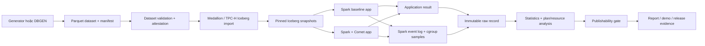
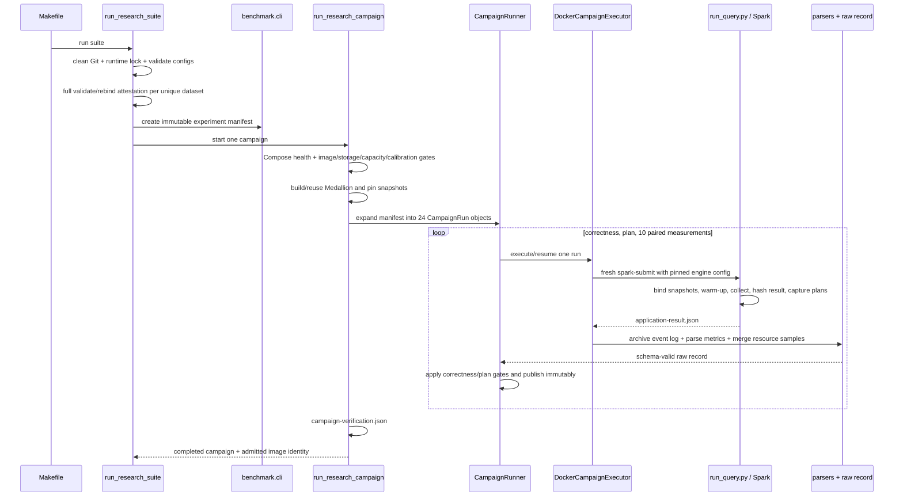

# Learning roadmap: High-Performance Open Lakehouse Pipeline

Tài liệu này là bản đồ học codebase theo **dependency và execution flow**, không theo alphabet và
không yêu cầu đọc hết từng file. Trục học chính là workload `M02`: đủ nhỏ để hiểu, nhưng đi xuyên
qua gần như toàn bộ hệ thống từ cấu hình đến báo cáo.

## 1. Mental model đúng về project

Đây không phải một ứng dụng Spark production chạy liên tục. Đây là một **hệ thống nghiên cứu
benchmark có kiểm soát và có thể kiểm chứng lại**, nhằm trả lời:

> Với cùng dữ liệu, SQL, Iceberg snapshot và resource envelope, Spark baseline và Spark có bật
> DataFusion Comet khác nhau thế nào về latency, CPU, RAM, GC, shuffle, native coverage và
> fallback?

Project có ba mặt phẳng:

1. **Data/execution plane**: sinh dữ liệu → Parquet → Iceberg → Spark SQL → Spark JVM hoặc Comet
   native execution.
2. **Control/evidence plane**: khóa config/runtime/input → lập lịch → kiểm tra môi trường → chạy →
   thu event log/resource → tạo raw record bất biến → quyết định có được công bố hay không.
3. **Delivery plane**: report, chart, Spark UI demo, presentation, video và evidence bundle.



Điểm quan trọng: Comet không thay Spark. Spark vẫn parse SQL, tạo logical/physical plan và điều
phối application. Comet plugin thay thế các operator được hỗ trợ bằng native operator chạy trên
DataFusion/Rust/Arrow; phần không hỗ trợ vẫn chạy bằng Spark JVM và có thể cần transition giữa row
và columnar.

## 2. Không có một entry point duy nhất

`Makefile` là entry point vận hành cấp cao. Bên dưới nó có nhiều chương trình nhỏ, mỗi chương trình
sở hữu một ranh giới trách nhiệm rõ ràng.

| Ý định | Entry point thực | Vai trò |
|---|---|---|
| Kiểm tra/lập plan | `lakehouse-bench` → `benchmark.cli:main` | Validate input, tạo experiment manifest, phân tích plan, summarize |
| Sinh E-commerce data | `python -m data.generator` | Generate/validate dataset độc lập |
| Chạy toàn bộ benchmark | `scripts/run_research_suite.py` | Mặc định chuẩn bị 10 core campaign và giữ một image identity xuyên suite |
| Chạy một campaign | `scripts/run_research_campaign.py` | Dựng môi trường, gate, Medallion, 24 logical run slots cho core config cùng các retry bất biến, verification |
| Chạy một Spark application | `pipeline/benchmark/run_query.py` | Bind snapshot/view, warm-up, execute, capture app result |
| Smoke nhỏ | `scripts/run_native_smoke.sh` | Chứng minh Spark/Comet/Iceberg hoạt động; không tạo research result |
| Tạo report | `python -m analysis.scripts.build_report` | Rebuild analysis và đánh giá publishability |
| Đóng gói release | `scripts/build_evidence_bundle.py` | Thu toàn bộ bằng chứng và tạo ZIP có thể verify/restore |

Hai flow nên học riêng:

- **Readiness flow**: `make smoke`. Nhỏ, dễ quan sát, nhưng không đại diện cho benchmark protocol.
- **Research flow**: `make benchmark` → `make report`. Đây là flow chính cần hiểu sâu.

## 3. Execution flow chính từ đầu đến cuối

### 3.1 `make benchmark`



Flow cụ thể:

1. `Makefile` chạy setup, lint, tests và kiểm tra Docker Compose trước khi gọi suite.
2. `prepare_suite()` yêu cầu clean Git commit, đúng Python trong runtime lock, load tất cả config,
   cấm trùng query ID và gom config theo dataset.
3. Mỗi dataset chỉ full-validate một lần. Nếu có full attestation hợp lệ ở ancestor commit và code
   semantic validator không đổi, `rebind_attestation()` tạo receipt mới mà không scan lại toàn bộ
   rows. Nếu không, `create_attestation()` chạy full validator.
4. `command_plan()` validate config/workload/SQL/dataset/runtime profile, tạo lịch paired AB/BA,
   hash mọi immutable input rồi ghi `experiment-manifest.json`.
5. `run_suite()` kiểm tra resume state và buộc tất cả campaign dùng cùng Spark image digest.
6. Mỗi campaign start Compose services, kiểm tra health, image identity, Docker volume identity,
   CPU model, disk/memory/CPU/swap/small-file capacity và resource-collector overhead.
7. `_prepare_medallion()` import Parquet vào Iceberg. E-commerce tạo Bronze/Silver/Gold; TPC-H
   import tám bảng vào `lakehouse.tpch`. Audit giữ row counts và snapshot ID.
8. `plan_campaign()` tạo đúng 24 run:
   - 2 correctness runs: baseline rồi Comet;
   - 2 plan-capture runs: baseline rồi Comet;
   - 10 pair × 2 engine = 20 measurement runs theo lịch AB/BA.
9. `CampaignRunner.run()` duyệt plan, preflight mọi artifact khi resume và chỉ cho measurement chạy
   sau khi correctness gate và plan gate pass.
10. `DockerCampaignExecutor.__call__()` tạo attempt directory bất biến, start worker sampler, mount
    event-log staging và gọi một `spark-submit` mới.
11. `pipeline/benchmark/run_query.py:main()`:
    - load experiment + workload contract;
    - render typed SQL parameters;
    - tạo `SparkSession` và fingerprint runtime/classpath;
    - load đúng Iceberg snapshot, validate column binding, tạo temp views;
    - chạy warm-ups ngoài measurement;
    - arm sampler ngay trước terminal action;
    - gắn `jobGroupId = run_id`, gọi `collect()`, đo wall time;
    - capture initial/final AQE plan, driver resources, schema hash và canonical result hash;
    - ghi `application-result.json` cùng plan/resource artifacts.
12. Executor archive native event log, `parse_event_log()` quy task/stage/job về đúng SQL execution,
    `build_raw_record()` hợp nhất application result + event metrics + cgroup metrics + provenance.
13. Success được publish vào `results/raw`; failed/timeout attempts được giữ ngoài raw và retry tối
    đa ba lần. `invalid_result` và `invalid_environment` hard-stop.
14. Campaign verification hash và bind toàn bộ raw/control/attempt artifacts. Suite sau đó chuyển
    sang campaign tiếp theo với cùng image digest.

### 3.2 `make report`

1. `build_report()` load tất cả raw JSON và validate schema.
2. `assess_report_publishability()` independently kiểm tra exact 10 core campaigns, clean/current
   Git provenance, 24/24 records mỗi campaign, attestation, capacity/calibration/Medallion, file
   hashes, correctness, plan completeness, collector completeness và đủ 10 pairs.
3. `summarize_records()` tính descriptive statistics, paired speedup, paired resource savings và
   deterministic bootstrap CI 95%.
4. `build_plan_insights()`, `build_resource_profiles()` và `build_research_findings()` tạo các lớp
   phân tích chuyên biệt.
5. `build_report()` ghi các JSON/CSV dẫn xuất, gọi `report_charts.py` để render SVG và
   `_report_markdown()` để tạo Markdown.
6. `report-contract.json` kiểm tra nội dung report. Chỉ khi evidence gate và report contract cùng
   pass thì `publishable` mới là `true`.

## 4. Artifact lineage và state cần theo dõi

| Artifact | Được tạo bởi | Input identity chính | Consumer |
|---|---|---|---|
| Dataset `manifest.json` | generator/converter | profile, seed, source, Parquet hashes | validator, attestation, Medallion, config validation |
| Dataset attestation | `create/rebind_attestation` | manifest, physical inventory, runtime, Git tree | experiment plan, Medallion, publication gate |
| Experiment manifest | `command_plan()` | config, SQL, workload manifest, dataset, locks, Spark profiles | suite, campaign planner, verifier |
| Medallion audit | `pipeline.medallion.build` | dataset + attestation + image/storage identity | query executor, campaign verifier |
| Attempt admission | campaign launcher | run identity + provenance + runtime | crash recovery, publication verifier |
| Application result | `run_query.py` | snapshot-bound SQL execution | Docker executor |
| Event log/resource samples | Spark + samplers | one application/measurement window | parser, raw record, report verifier |
| Raw record | `build_raw_record()` | app result + event log + resource + provenance | summary/report |
| Campaign verification | campaign script | planned raw set + all control artifacts | suite resume, publishability, release |
| Report artifacts | `build_report()` | current raw + campaign evidence | deck, video, evidence bundle |
| Release ZIP | evidence bundle code | Git history + data + raw/control/report/demo | offline verify/restore |

State quan trọng nhất không nằm trong Python object sống lâu; nó nằm trong **immutable files** và
external state:

- Git commit và tree object IDs;
- Docker image digest và named-volume identity;
- MinIO objects + Iceberg catalog/snapshot IDs;
- `.artifacts/` cho attempts, plans, attestations và control evidence;
- `results/raw/` chỉ chứa terminal successful research records trong retry mode;
- `results/reports/report-publishability.json` là nguồn quyết định có được công bố hay không.

## 5. Vai trò folder theo dependency

| Folder/file | Vai trò thật | Học khi nào |
|---|---|---|
| `README.md`, `docs/adr/` | Scope, research questions, quyết định đã chốt | Đầu tiên |
| `Makefile` | Public operational API và orchestration graph | Ngay sau kiến trúc |
| `benchmark/runner/` | Domain/control-plane core: config, campaign, records, stats, provenance | Core execution |
| `pipeline/benchmark/` | Code chạy bên trong mỗi Spark benchmark application | Core execution |
| `scripts/run_research_*.py` | Adapter giữa pure control logic và Docker/Linux runtime | Core execution rồi integration |
| `data/generator/` | Deterministic E-commerce domain + Parquet generation/validation | Sau khi hiểu một campaign |
| `data/tpch/` | Locked DBGEN acquisition, schema/key contracts, conversion/validation | Sau E-commerce data path |
| `pipeline/medallion/` | Parquet → Iceberg, Bronze/Silver/Gold hoặc TPC-H import, snapshot audit | Data path |
| `workloads/` | SQL và workload contracts; không chỉ là query text | Học song song với M02 rồi mở rộng |
| `benchmark/parsers/` | Final plan, golden plan và Spark event-log interpretation | Measurement internals |
| `benchmark/collectors/` | Cgroup/proc resource sampling và calibration | Measurement internals |
| `analysis/` | Pure/rebuildable post-processing và publication policy | Sau raw record |
| `benchmark/schemas/` | Machine-readable boundary contracts | Đọc theo artifact, không đọc một lượt |
| `infrastructure/` | Docker images, Spark properties, MinIO/Iceberg integration | Sau core flow để config có ngữ cảnh |
| `tests/` | Executable specification của invariant và failure mode | Đi cùng từng phase |
| `scripts/*demo*`, `*presentation*`, `*evidence_bundle*` | Delivery/release chain | Advanced, học cuối |
| `.artifacts/`, `results/`, `data/generated/` | Runtime/generated evidence, không phải source domain | Dùng để trace, không đọc tuần tự |

## 6. Roadmap học theo phase

Mỗi “session” nên dài 60–90 phút. Không cần giữ đúng lịch; chỉ chuyển phase khi đạt exit criteria.

### Phase 0 — Scope và vocabulary (1–2 sessions)

**Đọc theo thứ tự**

1. `README.md`: mục tiêu, architecture, workload levels, quick start và ranh giới publishability.
2. `docs/adr/0001-first-vertical-slice.md`: tại sao bắt đầu bằng smoke, classpath và native constraint.
3. `docs/adr/0002-laptop-research-scope.md`: tại sao chỉ single-node, 2 cores, SF1 chính, 10 pairs.
4. `docs/implementation-status.md`: chỉ đọc các phần implemented controls và evidence boundary.

**Phải tự trả lời được**

- Project đo cái gì, không đo cái gì?
- “Spark baseline”, “Comet accelerated”, “native operator”, “fallback”, “transition” khác nhau ra sao?
- Vì sao smoke pass không đồng nghĩa benchmark result có thể công bố?
- Vì sao TPC-H ở đây là “TPC-H-derived, non-audited”?

**Exit criteria**: tự trình bày kiến trúc trong 5 phút mà chưa cần kể tên từng file.

### Phase 1 — Entry point và operational graph (1–2 sessions)

**Đọc**

1. `Makefile`: chỉ các target `validate`, `plan`, `smoke`, `benchmark`, `report`, `release` và
   dependencies trực tiếp của chúng.
2. `pyproject.toml`: package, dependency, `lakehouse-bench` entry point, lint/type/test config.
3. `benchmark/cli.py`: bắt đầu từ `parser()` và `main()`, rồi đi ngược vào từng command.
4. `scripts/run_research_suite.py`: bắt đầu từ `main()` → `run_suite()` → `prepare_suite()`.

**Lab an toàn, không cần Docker**

```bash
uv run lakehouse-bench validate --config benchmark/configs/smoke-m02.yaml
uv run lakehouse-bench plan --config benchmark/configs/smoke-m02.yaml
```

Sau đó mở plan vừa tạo và nối từng `input_hashes` về source file tương ứng.

**Exit criteria**: biết lệnh nào chỉ validate, lệnh nào tạo artifact, lệnh nào khởi động Docker và
lệnh nào có thể chạy campaign dài.

### Phase 2 — Vertical slice nhỏ bằng smoke (2 sessions)

**Trace theo call order**

1. `scripts/run_native_smoke.sh` — orchestration.
2. `pipeline/smoke/prepare_iceberg.py` — fixture Parquet → một Iceberg table + snapshot.
3. `pipeline/smoke/run_workload.py` — baseline/Comet execution.
4. `pipeline/smoke/runtime_check.py:fingerprint()` — runtime/classpath proof.
5. `pipeline/smoke/verify_smoke.py` — correctness + golden-plan verification.

**Lab**

- Trước khi chạy, dự đoán artifact nào sẽ được tạo.
- Chạy `make smoke` trong Ubuntu/WSL khi Docker Desktop sẵn sàng.
- Mở baseline/comet `result.json` và `final-plan.txt`; tìm schema hash, result hash, snapshot ID,
  native operator count và runtime fingerprint.

**Exit criteria**: giải thích được một SQL query đi từ Parquet qua Iceberg đến hai physical plans.

### Phase 3 — Core campaign protocol (3–4 sessions)

Đây là phase quan trọng nhất.

**Đọc theo call graph**

1. `benchmark/runner/config.py:build_experiment_manifest()`.
2. `benchmark/runner/schedule.py:paired_randomized_schedule()`.
3. `benchmark/runner/campaign.py:plan_campaign()` và ba dataclass `CampaignRun`,
   `CampaignReport`, `ProcessOutcome`.
4. `benchmark/runner/campaign.py:CampaignRunner.run()`.
5. `scripts/run_research_campaign.py:main()`.
6. `scripts/run_research_campaign.py:DockerCampaignExecutor` theo thứ tự
   `expected_provenance()` → `__call__()` → `recover_interrupted_attempt()`.
7. `pipeline/benchmark/run_query.py:main()`.
8. `benchmark/runner/record.py:build_raw_record()`.

**Trace một run thật**

Dùng `EXP-ECOM-SMALL-M02`, pair 1, baseline. Đi từ:

`benchmark/configs/benchmark-laptop-m02.yaml`
→ `.artifacts/campaigns/EXP-ECOM-SMALL-M02/experiment-manifest.json`
→ `results/raw/EXP-ECOM-SMALL-M02/spark_baseline/measurement-p0001-...json`
→ các path trong trường `artifacts`
→ attempt directory chứa `application-result.json`, plans, event log và resource samples.

Với mỗi bước, ghi lại: input nào được hash, process/container nào chạy, file nào được tạo, state
nào có thể reuse và điều kiện nào hard-stop.

**Lab bằng tests**

```bash
uv run pytest tests/test_schedule.py tests/test_campaign.py
uv run pytest tests/test_research_suite.py tests/test_research_campaign.py
uv run pytest tests/test_research_query_runner.py tests/test_raw_record_builder.py
```

**Exit criteria**: vẽ lại được 24 runs của một campaign và giải thích vì sao measurement không thể
chạy trước correctness/plan gate.

### Phase 4 — Core domain model và contracts (2 sessions)

Không học model theo folder; học theo lifecycle:

1. `GeneratorProfile`/`SourceLock` mô tả nguồn dữ liệu.
2. Dataset manifest mô tả physical/logical identity.
3. `VerifiedDataset` mô tả attestation đã kiểm chứng.
4. Experiment manifest mô tả protocol bất biến.
5. `CampaignRun` mô tả một Spark application cần chạy.
6. `ResourceSample`/`EventLogReport` mô tả observation độc lập.
7. `RawRecordContext` + raw record hợp nhất observation và provenance.
8. Summary/findings/report mô tả derived evidence.

Với mỗi object/artifact, trả lời bảy câu:

1. Tại sao nó tồn tại?
2. Ai tạo?
3. Input nào bắt buộc?
4. Output/field nào là identity?
5. Ai consume?
6. State nào thay đổi hoặc được persist?
7. Test nào khóa invariant này?

**Exit criteria**: phân biệt rõ runtime object, persisted artifact và external state.

### Phase 5 — Data domain và Iceberg snapshots (3 sessions)

**E-commerce path**

1. `data/generator/profiles.py` → `GeneratorProfile` và semantic gates.
2. `data/generator/prf.py` → counter-based deterministic fields, không có global RNG state.
3. `data/generator/rows.py` → quan hệ customer/order/item/event.
4. `data/generator/manifest.py` → streaming audit và PK-range Merkle hash.
5. `data/generator/generate.py` → streaming Parquet + atomic publish.
6. `data/generator/validation.py` → schema/PK/FK/date/funnel/content checks.
7. `pipeline/medallion/build.py` → Bronze → Silver → Gold và pinned snapshots.

**TPC-H path**

1. `data/tpch/contract.py` → schema, PK, FK, row counts, date bounds.
2. `data/tpch/source.py` → locked source download/build/materialization.
3. `data/tpch/dataset.py` → `.tbl` parse/normalize → Parquet → full validation.
4. `pipeline/medallion/build.py:_build_tpch_tables()` → Iceberg import.

**Lab**

```bash
uv run pytest tests/test_generator_determinism.py tests/test_generator_validation.py
uv run pytest tests/test_tpch_data.py tests/test_medallion_contract.py
```

Thay đổi `rows_per_file` trên một profile fixture tạm trong test và dự đoán trước: row content hash
có đổi không, file inventory hash có đổi không, dataset identity nào bị ảnh hưởng?

**Exit criteria**: giải thích được vì sao cùng logical rows vẫn có thể là physical dataset khác,
và vì sao query luôn dùng snapshot ID thay vì “latest”.

### Phase 6 — Workload contract, SQL và engine matrix (2 sessions)

Học workload theo độ phức tạp operator:

1. `M02`: scan + filter + aggregate.
2. `M05`: low-cardinality aggregate.
3. `M04`: join.
4. `M08`: window; chú ý partial native/fallback.
5. `M10`: high-cardinality aggregate + shuffle.
6. `B01`: business join + aggregate.
7. `Q06` → `Q01` → `Q12` → `Q03`: từ filter/reduction đến multi-join.

Mỗi workload luôn đọc theo bộ ba:

`benchmark/configs/*.yaml` → `workloads/manifests/**/*.yaml` → `workloads/**/*.sql`.

Config chọn experiment/runtime/parameters. Workload manifest là contract reusable của query:
relation bindings, parameter types, expected schema, ordering và operator tags. SQL chỉ là logic
thực thi.

Đọc thêm:

- `benchmark/runner/sql.py:render_sql()` để hiểu typed substitution;
- `canonical_result_hash()` để hiểu so sánh ordered/unordered result;
- `benchmark/runner/config.py:validate_engine_matrix()` để thấy baseline rỗng và Comet chỉ được
  phép khác ở allowlisted keys.

**Exit criteria**: có thể thêm một diagnostic workload mới mà không nhầm config với workload
contract và không vô tình thêm nó vào exact core publication set.

### Phase 7 — Measurement internals (3–4 sessions)

**Plan path**

1. `benchmark/parsers/plan.py`: wrapper, transition, Spark operators, native Comet operators,
   non-native Comet operators, unknown nodes.
2. `benchmark/parsers/golden.py`: versioned regression contract cho plan semantics.
3. `analysis/plan_insights.py`: stability và paired coverage analysis.

**Event/resource path**

1. Đọc public dataclasses ở đầu `benchmark/parsers/eventlog.py`.
2. Đọc `parse_event_logs()` rồi mới quay vào `_EventLogParser.consume()/finish()`.
3. Đọc `select_measured_execution()` để hiểu `jobGroupId` và nested execution family.
4. Đọc `ResourceSample`, `ResourceSummary`, `create_resource_source()`, `aggregate_samples()` và
   `ResourceSampler` trong `benchmark/collectors/resources.py`.
5. Đọc capacity dataclasses và `evaluate_capacity_gate()` trong `benchmark/runner/capacity.py`.

**Nguyên tắc xuyên suốt**: unknown/missing phải là `None`, `partial` hoặc `unavailable`; tuyệt đối
không tự biến thành zero và làm đẹp kết quả.

**Lab**

```bash
uv run pytest tests/test_plan_parser.py tests/test_plan_golden.py tests/test_core_plan_golden.py
uv run pytest tests/test_eventlog_parser.py tests/test_resource_collector.py
uv run pytest tests/test_capacity.py tests/test_collector_calibration.py
```

**Exit criteria**: từ một raw record, chỉ ra metric nào đến từ driver timing, Spark event log và
cgroup sampler; giải thích tại sao chúng không thay thế cho nhau.

### Phase 8 — Statistics, analysis và publishability (3 sessions)

**Đọc theo data transformation**

1. `benchmark/runner/statistics.py`: percentile R-7, describe, pair alignment, bootstrap CI.
2. `benchmark/runner/summary.py:summarize_records()`.
3. `analysis/resource_profiles.py`.
4. `analysis/plan_insights.py`.
5. `analysis/research_findings.py`.
6. `analysis/report_publishability.py:assess_report_publishability()`; đọc helper khi gặp gate.
7. `analysis/scripts/build_report.py:build_report()`.
8. `analysis/report_charts.py` sau cùng vì đây là presentation của derived values.

**Câu hỏi bắt buộc**

- Tại sao estimator chính là median của paired speedups chứ không chỉ ratio of medians?
- AB/BA xử lý loại bias nào? Nó không xử lý được loại bias nào?
- Vì sao n=10 không dùng P95 làm deliverable?
- Evidence gate khác report-content contract như thế nào?

**Lab**

```bash
uv run pytest tests/test_statistics.py tests/test_summary.py
uv run pytest tests/test_plan_insights.py tests/test_resource_profiles.py
uv run pytest tests/test_research_findings.py tests/test_report_publishability.py
uv run pytest tests/test_analysis_report.py tests/test_report_charts.py
```

Repository có thể giữ đủ 240 raw records để trace (24 × 10 campaign), nhưng trạng thái của chúng
phải được đọc từ `report-publishability.json`. Khi artifact này chưa tồn tại hoặc không ghi
`publishable: true`, mọi con số chỉ được dùng cho học/debug cho đến khi strict report trên evidence
gắn đúng current commit vượt toàn bộ gate.

**Exit criteria**: tự giải thích một summary từ raw pairs và chỉ ra chính xác gate nào khiến report
được hoặc không được công bố.

### Phase 9 — Infrastructure và integration (2–3 sessions)

Lúc này mới đọc infrastructure; nếu đọc sớm, các property chỉ là danh sách khó nhớ.

1. `docker-compose.yml`: services, health dependencies, ports, volumes và resource limits.
2. `infrastructure/docker/spark/Dockerfile`: pinned Spark base, exact CPython, Comet/Iceberg jars,
   hash verification, non-root user.
3. `infrastructure/spark/profiles/benchmark-laptop-common.properties`.
4. `infrastructure/spark/profiles/benchmark-laptop-comet.properties`.
5. `infrastructure/spark/spark-defaults.conf` và `profiles/comet.properties` cho smoke.
6. `infrastructure/minio/init-buckets.sh` và Iceberg REST/MinIO Dockerfiles.
7. `runtime-versions.lock` như software bill of materials và runtime contract.

Vẽ network/data path:

Spark client/driver liên hệ Spark master; executor chạy trên Spark worker. Iceberg catalog metadata
được resolve qua REST catalog, còn Iceberg `S3FileIO` đọc/ghi objects ở MinIO. Không đưa
`hadoop-aws` vào classpath của slice này để tránh AWS SDK conflict.

**Exit criteria**: giải thích được mỗi container, port, volume và tại sao persistent volume identity
là một phần của research provenance.

### Phase 10 — Configuration, schemas và utilities (2–3 sessions)

**Configuration/contracts**

- `experiment-config.schema.json`: user-authored experiment.
- `workload-manifest.schema.json`: reusable query contract.
- `experiment-manifest.schema.json`: resolved immutable plan.
- `raw-result.schema.json`: một run record.
- `summary.schema.json`: derived per-experiment summary.
- dataset/attestation/evidence schemas: đọc khi học đúng artifact tương ứng.

Đọc schema bằng cách đặt cạnh một instance thật; không đọc toàn bộ schema folder trong một lượt.

**Utilities theo dependency**

1. `benchmark/runner/canonical.py`: normalization, canonical JSON, SHA-256, immutable write.
2. `benchmark/runner/runtime.py`: validate runtime lock.
3. `benchmark/runner/evidence.py`: clean Git, raw digest, artifact/control tree evidence.
4. `scripts/redact_logs.py`: secret removal trước khi logs trở thành evidence.
5. `scripts/bootstrap_env.py`: local credential/bootstrap boundary.

**Exit criteria**: biết khi nào hash đại diện cho payload JSON, file bytes, directory tree, dataset
logical content, physical inventory hoặc Git tree; không dùng chúng thay thế lẫn nhau.

### Phase 11 — Tests như executable specification (2 sessions, rồi dùng liên tục)

Thứ tự đọc test nên phản chiếu dependency:

1. Pure foundations: `test_canonical`, `test_schedule`, `test_sql`, `test_statistics`.
2. Config/data contracts: `test_config_validation`, `test_generator_*`, `test_tpch_data`.
3. Core protocol: `test_campaign`, `test_raw_record_builder`.
4. Runtime adapters: `test_research_suite`, `test_research_campaign`, `test_medallion_contract`.
5. Observability: `test_plan_parser`, `test_eventlog_parser`, `test_resource_collector`.
6. Analysis/publication: `test_summary`, `test_*insights`, `test_report_publishability`,
   `test_analysis_report`.
7. Delivery: demo, presentation, video, evidence bundle, archive tests.

Khi đọc một test, viết lại dưới dạng:

> Given state/input nào → when function nào chạy → then invariant hoặc failure nào phải xảy ra?

Đặc biệt đọc cả happy path và fail-closed cases. Codebase này định nghĩa chất lượng phần lớn qua
việc **từ chối evidence mơ hồ hoặc stale**, không chỉ qua output đúng ở happy path.

**Exit criteria**: trước khi sửa code, biết test file nào là regression boundary và có thể viết test
fail trước khi implement.

### Phase 12 — Advanced/internal implementation (4+ sessions)

Chỉ vào phase này sau khi đã tự trace được M02 end-to-end.

1. `dataset_attestation.py`: full/rebound receipt, Git ancestry, semantic-tree identity, offline
   container verification.
2. `eventlog.py`: state machine liên kết SQL execution → job → stage → task attempt; ambiguous và
   background work buckets.
3. `resources.py`: cgroup v2 discovery, `/proc` fallback, counter reset và boundary samples.
4. `run_research_campaign.py`: native event-log staging trên Linux, interrupted-attempt recovery,
   exact image pinning và immutable retry history.
5. `report_publishability.py`: independent reconstruction thay vì tin raw declarations.
6. `scripts/archive_research_evidence.py`: transactional evidence rotation.
7. `scripts/prepare_spark_ui_demo.py` + `verify_spark_ui_demo.py`.
8. `scripts/finalize_presentation.py` + `finalize_demo_video.py`.
9. `scripts/evidence_bundle.py`: closure của Git/data/raw/control/report/demo và offline verification.

Không bắt đầu bằng `scripts/evidence_bundle.py`: nó dài vì bảo vệ ranh giới release và chỉ dễ hiểu
sau khi đã biết mọi artifact mà nó đóng gói.

**Exit criteria**: giải thích được crash ở bốn thời điểm khác nhau sẽ để lại state gì và tại sao
resume được phép hoặc bị chặn.

## 7. Symbol map: class/function quan trọng

| Symbol | Tại sao tồn tại | Input → output | Caller → callees/state |
|---|---|---|---|
| `load_document()` | Parse YAML an toàn, resolve env, schema validate | path + schema → dict | CLI/campaign/query → PyYAML + JSON Schema |
| `load_experiment()` | Thêm semantic engine-matrix gate | experiment YAML → validated config | CLI/suite/query → `load_document`, `validate_engine_matrix` |
| `build_experiment_manifest()` | Freeze protocol và hashes | config + input paths + attestation → manifest | `command_plan` → schedule, hashing, redaction |
| `paired_randomized_schedule()` | Balanced deterministic AB/BA | run count + seed + engines → pairs | manifest builder; không mutate global RNG |
| `CampaignRun` | Identity của một Spark application | manifest fields → immutable dataclass | `plan_campaign` tạo; runner/executor consume |
| `plan_campaign()` | Materialize protocol thành `4 + 2 × measurement_runs` logical run slots (24 cho core) | manifest → tuple of `CampaignRun` | runner/verifiers; correctness → plan → measurement order |
| `CampaignRunner.run()` | Execute/resume/retry mà không overwrite evidence | manifest + executor + roots → `CampaignReport` | campaign script → gates, executor, immutable writes |
| `DockerCampaignExecutor.__call__()` | Adapter từ logical run sang Docker/Spark/evidence | `CampaignRun` → raw-record mapping | runner → sampler, spark-submit, event parser, record builder |
| `recover_interrupted_attempt()` | Đóng orphan attempt sau crash | run + raw/failure roots → failure evidence hoặc hard-stop | runner preflight → admission/event-log recovery |
| `run_query.main()` | Sở hữu one-app measured execution boundary | CLI args/config/snapshot → application artifacts | executor → SparkSession, SQL, sampler, plan/result hash |
| `fingerprint()` | Chứng minh runtime/classpath đúng lock và engine | SparkSession + engine → runtime dict | smoke/query/Medallion → JVM resources + jar hashes |
| `render_sql()` | Typed, complete parameter substitution | SQL + definitions + values → rendered SQL | validation/query → `_render_value` |
| `canonical_result_hash()` | So sánh result độc lập với serialization | collected rows + ordering → SHA-256 | smoke/query; sort rows khi unordered |
| `analyze_plan()` | Conservative native/fallback classification | final plan text → `PlanAnalysis` dict | query/smoke/report → exact operator sets |
| `parse_event_log(s)` | Attribution metrics mà không trộn background work | NDJSON/gzip/rolling logs → `EventLogReport` | executor/report verifier → internal state machine |
| `select_measured_execution()` | Chọn đúng SQL family bằng run ID | event report + run_id → attribution | raw builder → aggregate nested execution family |
| `ResourceSampler` | Sample resource counters trong measurement window | `ResourceSource` → samples/summary | query + worker sampler scripts; thread + boundary samples |
| `aggregate_samples()` | Chuyển counters/gauges thành auditable metrics | samples → `ResourceSummary` | sampler/capacity/report; preserves missing/partial |
| `evaluate_capacity_gate()` | Pure admission policy | config + dataset manifest + observed snapshot → result | campaign/report verifier; không tự inspect host |
| `RawRecordContext` | Mang host/runtime artifact context vào builder | provenance/resources/paths | Docker executor tạo; record builders consume |
| `build_raw_record()` | Merge ba nguồn evidence | run + app + event report + context → raw JSON | executor → execution selection + schema validation |
| `summarize_records()` | Per-experiment paired statistics | measurement raw rows → summary dict | CLI/report → statistics helpers |
| `assess_report_publishability()` | Reconstruct independent publication decision | all records + campaign root → policy result | report builder → configs, plans, files, attestations, gates |
| `build_report()` | Orchestrate all derived analysis | raw root + output → produced paths | Make target → summaries, insights, findings, charts, contracts |
| `GeneratorProfile` | Immutable semantic config cho synthetic data | YAML mapping → dataclass | generator/validator/rows |
| `field_digest()` | Row stable dù generation order/file size đổi | seed/table/PK/field → digest | row functions; no process-global state |
| `TableAudit` | Streaming identity + stats + PK order | rows → content hash/ranges/min-max/nulls | generator và validator |
| `generate_dataset()` | Atomic immutable Parquet publication | profile + output → `GenerationResult` | generator CLI/ensure scripts → row iterators, audit, PyArrow |
| `validate_dataset()` | Full E-commerce semantic validator | dataset dir → `ValidationReport` | CLI/attestation/Medallion → Parquet scan + relational state |
| `SourceLock` | Typed TPC-H source provenance | runtime lock fields → source identity | ensure/source functions |
| `build_dataset_from_tbl()` | Convert locked DBGEN output | raw `.tbl` + provenance → Parquet manifest | ensure TPC-H → parsers/audits/validation |
| `validate_tpch_dataset()` | Enforce SF1 schema/count/PK/FK/date/source contract | dataset root → validation report | ensure/attestation/Medallion |
| `create_attestation()` | Full semantic validation receipt | repo + manifest + commit → `VerifiedDataset` | suite preparation → validators + physical inventory + Git tree |
| `rebind_attestation()` | Reuse exact ancestor full receipt | origin receipt + current commit → new receipt | suite preparation; no row scan if all identities match |
| `verify_attestation()` | Recheck receipt/content/lineage | manifest + receipt + runtime/commit → verified object | planning/Medallion/report |
| `pipeline.medallion.build.main()` | Import validated data và record snapshots | dataset + attestation → Medallion audit | campaign prep → Spark/Iceberg/quality gates |

## 8. Technology roadmap: học vừa đủ để đọc project

| Technology | Phần cần hiểu | Nơi quan sát trong repo |
|---|---|---|
| Spark SQL | lazy evaluation, action, Catalyst, physical plan, AQE, job/stage/task, event log | `run_query.py`, plans, `eventlog.py` |
| DataFusion Comet | plugin, native operator replacement, fallback, transitions, native shuffle | Comet profile, `plan.py`, baseline/comet plans |
| Arrow/PyArrow | columnar schemas, record batches, Parquet IO, decimal/date types | `data/generator`, `data/tpch` |
| Iceberg | catalog, table format v2, metadata/snapshots, time travel, REST catalog | `medallion/build.py`, `run_query.py`, Compose |
| Parquet | physical files, row groups, compression, schema nullability | generators/validators/Docker data mount |
| MinIO/S3 | object store khác table catalog; endpoint/path-style config | Compose + Spark properties |
| Docker/WSL | services, volumes, image digest, cgroups, Linux native library | Compose, Dockerfiles, campaign launcher |
| JSON Schema/YAML | syntactic contract và cross-field semantic validation | `benchmark/schemas`, `config.py` |
| Git/SHA-256 | provenance, content identity, immutable publication | `canonical.py`, `evidence.py`, attestation |
| Statistics | pairing, median, CV, percentile R-7, bootstrap CI | `statistics.py`, `summary.py` |
| Python typing/testing | dataclass, Protocol, immutable value objects, injected IO, pytest fixtures | runner/collector/parser tests |

Không cần học Scala hoặc Rust implementation của Spark/Comet trước. Chỉ đào xuống upstream khi
một observed operator, event field hoặc classpath behavior không thể giải thích từ repo.

## 9. Các design decisions phải hiểu, không chỉ ghi nhớ

1. **Paired randomized AB/BA** giảm order/cache drift và cho phép so sánh theo pair.
2. **Fresh Spark application per run** cô lập JVM/app lifecycle; tốn thời gian nhưng giảm state leak.
3. **Warm-up nằm ngoài terminal action** để cache/JIT warm-up không bị ghi vào measured window.
4. **Correctness và plan gate trước measurement** tránh thu nhiều số nhanh nhưng sai hoặc không hề
   chạy native.
5. **Pinned Iceberg snapshots** bảo đảm hai engine đọc cùng logical table version.
6. **Immutable artifacts + self/content hashes** khiến resume không thể im lặng overwrite lịch sử.
7. **Fail closed**: missing/unknown/partial không được suy diễn thành pass hay zero.
8. **Exact runtime/image/classpath pinning** vì một thay đổi jar, Python, Docker image hay AWS SDK có
   thể làm benchmark không còn so sánh được.
9. **Content-bound attestation** tránh full-scan lặp lại nhưng chỉ reuse khi semantic validator và
   toàn bộ identity vẫn đúng.
10. **Independent resource views**: driver process sampler và worker cgroup sampler bổ sung cho
    nhau; Spark event log cung cấp thêm task/stage metrics độc lập.
11. **Smoke và research evidence tách riêng** để diagnostic timing không bị nhầm thành kết quả.
12. **Strict publishability reconstructed từ source artifacts** thay vì tin một cờ `passed` ở raw.
13. **Laptop-bounded scope** ưu tiên repeatability và finishability hơn claim scale-out rộng.
14. **Exact core catalog** bảo vệ research protocol; thêm workload không phải thao tác code nhỏ mà
    có thể là thay đổi experimental design.

## 10. Debugging order sau khi đã học xong core

Khi một benchmark/report fail, debug theo dependency, không bắt đầu từ stack trace cuối cùng:

1. Config/schema/runtime lock có hợp lệ không?
2. Dataset manifest và attestation có đúng current commit/runtime/inventory không?
3. Experiment manifest có bind đúng input hashes và schedule không?
4. Compose service, exact image, volume identity, capacity và calibration có pass không?
5. Medallion audit có đúng dataset/attestation và đủ snapshot IDs không?
6. Attempt admission và Spark launcher có tạo đúng artifacts không?
7. `application-result.json` fail ở binding, runtime fingerprint, schema/result hay plan?
8. Event log có archive được và attribution có complete không?
9. Resource window có start/stop boundary, zero swap và complete metrics không?
10. Raw record có schema/provenance/correctness/plan/collector đúng không?
11. Campaign verification bind đủ file tree không?
12. Publishability fail ở evidence gate hay report-content contract?

## 11. Capstone để thoát phụ thuộc AI

### Capstone A — Teach-back

Không nhìn roadmap, tự trình bày trong 15 phút:

- mục tiêu và scope;
- data/control/delivery plane;
- một M02 measurement từ config đến raw record;
- correctness, plan, resource và publishability gates;
- một failure/resume scenario.

### Capstone B — Thêm diagnostic workload

Trên branch riêng:

1. Chọn một operator chưa có workload nhỏ riêng.
2. Viết SQL, workload manifest, expected schema và config diagnostic.
3. Thêm contract/unit tests.
4. Validate và tạo plan trước khi chạy native.
5. Chạy smoke/diagnostic, inspect baseline và Comet final plan.
6. Không thêm vào `CORE_CONFIGS` và không gọi kết quả là publishable research evidence.

### Capstone C — Debug có chủ đích

Trong test/temporary fixture, tạo ba lỗi riêng:

- schema hash mismatch;
- unknown plan node khiến analysis `partial`;
- resource sample thiếu boundary/counter reset.

Với mỗi lỗi, dự đoán layer phát hiện đầu tiên, status cuối (`failed`, `invalid_result`,
`invalid_environment`, `partial`) và artifact còn lại cho resume/debug.

### Final mastery checklist

- [ ] Giải thích được project và giới hạn claim mà không mở README.
- [ ] Vẽ được end-to-end flow và artifact lineage.
- [ ] Trace được một run bằng `run_id` qua plan, attempt, app result, event log, raw record, summary.
- [ ] Nêu được caller/callee/input/output/state/failure/test của các symbol trong bảng trên.
- [ ] Phân biệt được Spark/Catalyst/AQE, Comet/DataFusion/Arrow, Iceberg và MinIO.
- [ ] Biết sửa workload/config mà không phá core research protocol.
- [ ] Viết được regression test trước một bug fix.
- [ ] Debug theo layer thay vì thử sửa ngẫu nhiên.
- [ ] Giải thích được vì sao một con số đúng vẫn có thể không publishable.
- [ ] Tự thêm một diagnostic feature và tự bảo vệ correctness/provenance của nó.

## 12. Thứ tự ngắn gọn để luôn quay lại

```text
Architecture/scope
→ Makefile và CLI entry points
→ smoke vertical slice
→ suite/campaign/run_query/raw-record core path
→ domain objects và artifact lifecycle
→ generator/TPC-H/Medallion/workloads
→ plan/event/resource measurement internals
→ statistics/report/publishability
→ Docker/Spark/Iceberg/MinIO integration
→ schemas/canonical/provenance utilities
→ tests
→ attestation/recovery/demo/release internals
→ diagnostic feature + teach-back
```
